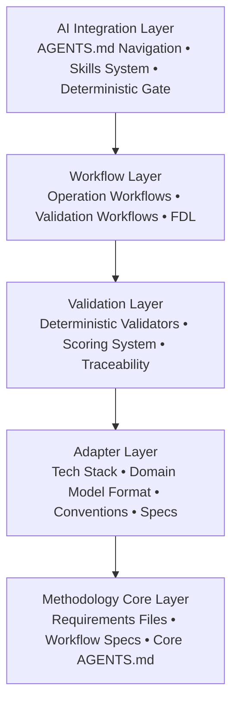
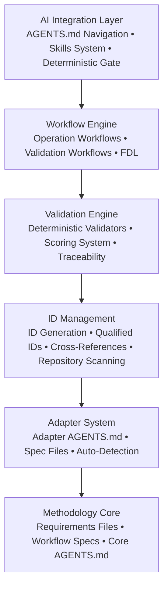
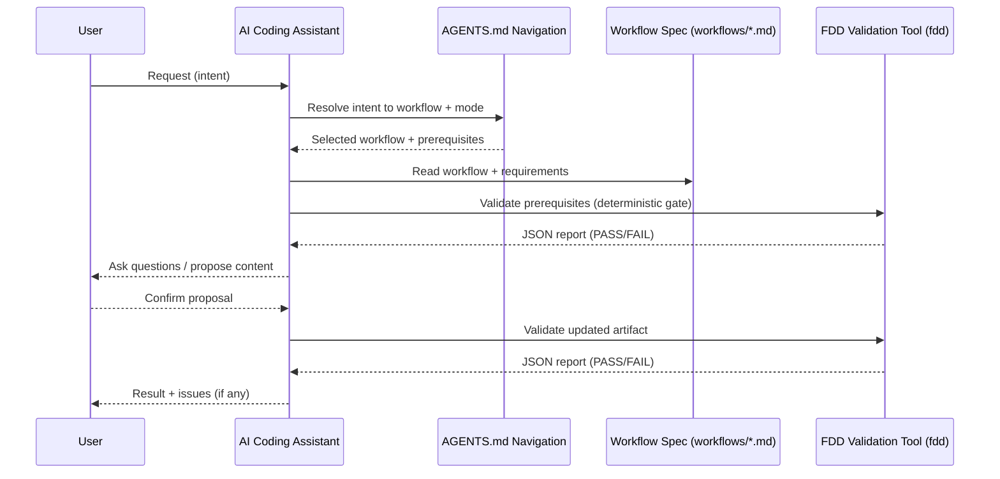
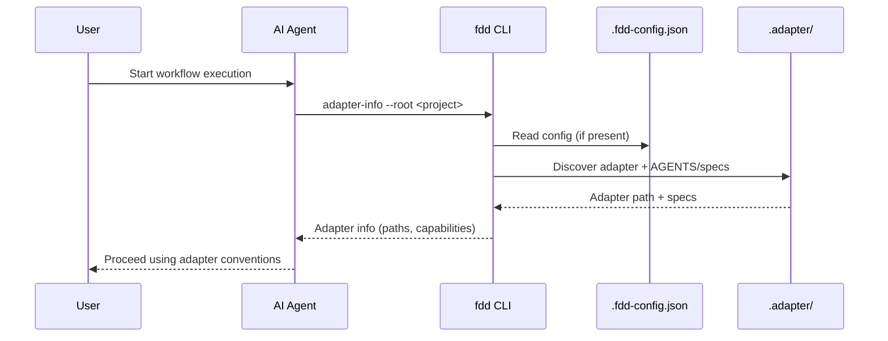
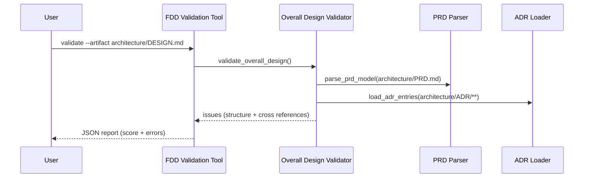
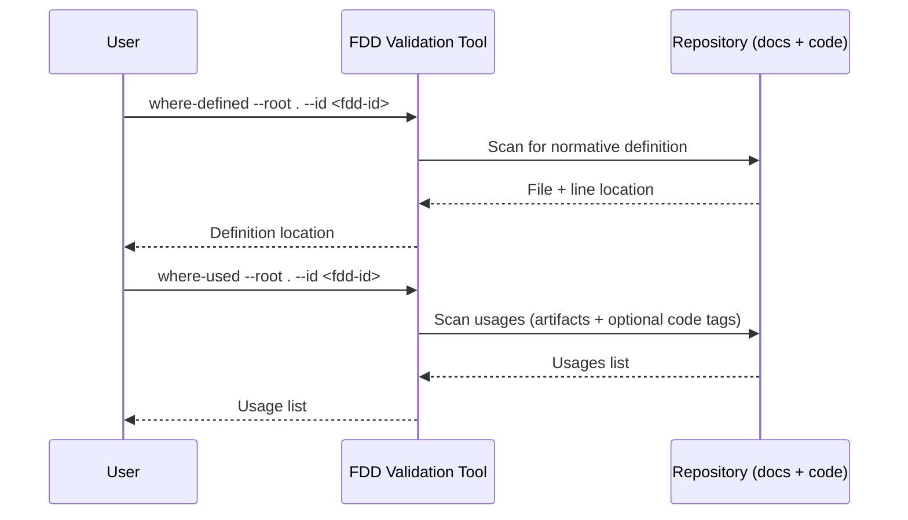

# Technical Design: FDD

## A. Architecture Overview

### Architectural Vision

FDD employs a **layered architecture with plugin-based extensibility** to provide a technology-agnostic methodology framework. The core methodology layer defines universal workflows and validation rules, while the adapter layer enables project-specific customization without modifying core specifications. This separation ensures that FDD remains compatible with any technology stack while maintaining consistent design and validation patterns across all projects.

In this design, “FDD” means **Flow-Driven Development** (workflow-centered).

The architecture follows a **flow-driven approach** where users may start from design, implementation, or validation workflows. If required design artifacts are missing, workflows MUST bootstrap them interactively (ask the minimal set of questions needed) and then continue.

Once created, design artifacts become the authoritative traceability source. The validation layer uses a **deterministic gate pattern** where automated validators catch structural issues before expensive manual review, ensuring quality while maximizing efficiency.

AI agent integration is achieved through machine-readable specifications (AGENTS.md navigation, workflow files, structure requirements) and a skills-based tooling system. The WHEN clause pattern in AGENTS.md files creates a discoverable navigation system where AI agents can autonomously determine which specifications to follow based on the current workflow context.

### Architecture drivers

#### Product requirements

| FDD ID | Solution short description |
|--------|----------------------------|
| `fdd-fdd-fr-workflow-execution` | Implement operation/validation workflows as Markdown files in `workflows/*.md` (Type: Operation/Validation), executed under `requirements/workflow-execution.md` + `requirements/execution-protocol.md`; drive deterministic tool entrypoint via `python3 skills/fdd/scripts/fdd.py <subcommand>` (see `skills/fdd/fdd.clispec`). |
| `fdd-fdd-fr-validation` | Implement deterministic validators in `skills/fdd/scripts/fdd/validation/**` (artifact validators under `validation/artifacts/*`); expose via `python3 skills/fdd/scripts/fdd.py validate` with JSON output and thresholds defined by `requirements/*-structure.md`. |
| `fdd-fdd-fr-adapter-config` | Implement adapter discovery via `python3 skills/fdd/scripts/fdd.py adapter-info` (reads `.fdd-config.json` and/or discovers `.adapter`); apply adapter rules from `.adapter/AGENTS.md` + `.adapter/specs/*.md` to workflows/validation (no hardcoded paths). |
| `fdd-fdd-fr-design-first` | Enforce prerequisites-first in workflow specs + execution protocol (`requirements/execution-protocol.md`): when a prerequisite artifact is missing, run the prerequisite workflow (Operation) instead of proceeding; then continue the original workflow (mode CREATE/UPDATE as defined in `workflows/*.md`). |
| `fdd-fdd-fr-traceability` | Implement ID scanning and traceability queries in `skills/fdd/scripts/fdd.py` subcommands (`scan-ids`, `where-defined`, `where-used`); implement optional code traceability via `@fdd-*` tags validated by `skills/fdd/scripts/fdd/validation/traceability.py` using regexes in `skills/fdd/scripts/fdd/constants.py`. |
| `fdd-fdd-fr-interactive-docs` | Provide CLI/agent-facing onboarding via `QUICKSTART.md` + `workflows/README.md` and keep agent navigation centralized in `AGENTS.md` + `workflows/AGENTS.md`; make docs executable by referencing requirements + templates + examples in each workflow. |
| `fdd-fdd-fr-artifact-templates` | Provide generation scaffolds in `templates/*.template.md`; workflows MUST reference templates explicitly (e.g., `workflows/design.md` → `templates/DESIGN.template.md`) and validators enforce required section structure from requirements files. |
| `fdd-fdd-fr-artifact-examples` | Provide canonical valid artifacts under `examples/requirements/**/valid.md`; validators use deterministic structure rules derived from `requirements/*-structure.md` and example patterns are used as reference for generation/review consistency. |
| `fdd-fdd-fr-arch-decision-mgmt` | Store ADRs under `architecture/ADR/**`; validate format via `requirements/adr-structure.md` + `skills/fdd/scripts/fdd/validation/artifacts/adr.py`; resolve ADR references in design/feature artifacts via cross-reference checks in validators. |
| `fdd-fdd-fr-prd-mgmt` | Create/update `architecture/PRD.md` via `workflows/prd.md`; validate via `requirements/prd-structure.md` + `skills/fdd/scripts/fdd/validation/artifacts/prd.py`; enforce stable actor/capability/usecase IDs via regex rules in `skills/fdd/scripts/fdd/constants.py`. |
| `fdd-fdd-fr-overall-design-mgmt` | Create/update `architecture/DESIGN.md` via `workflows/design.md`; validate via `requirements/overall-design-structure.md` + `skills/fdd/scripts/fdd/validation/artifacts/overall_design.py` including PRD/ADR cross-reference validation. |
| `fdd-fdd-fr-feature-manifest-mgmt` | Create/update `architecture/FEATURES.md` via `workflows/features.md`; validate via `requirements/features-manifest-structure.md` + `skills/fdd/scripts/fdd/validation/artifacts/features_manifest.py` (stable feature IDs, status, links to feature dirs). |
| `fdd-fdd-fr-feature-design-mgmt` | Create/update `architecture/features/feature-{slug}/DESIGN.md` via `workflows/feature.md`; validate via `requirements/feature-design-structure.md` + `skills/fdd/scripts/fdd/validation/artifacts/feature_design.py` (flows/algos/states/requirements IDs and structure). |
| `fdd-fdd-fr-feature-lifecycle` | Encode lifecycle via manifest status fields + validation gates: `workflows/features-validate.md` / `workflows/feature-validate.md` enforce allowed transitions and prerequisites (PRD/DESIGN/FEATURES dependencies). |
| `fdd-fdd-fr-code-generation` | Implement “design-to-code” workflow in `workflows/code.md`; require adapter specs (`.adapter/specs/*`) to drive language/project structure, and use `@fdd-*` tags for traceability when marking scopes implemented. |
| `fdd-fdd-fr-brownfield-support` | Support legacy projects via `workflows/adapter-from-sources.md` + `workflows/adapter-auto.md` (discovery) and allow validating artifacts without rigid repo layout using `adapter-info` + adapter-owned structure rules. |
| `fdd-fdd-fr-fdl` | Use FDL markers in feature design (scope `**ID**` line + numbered steps with `ph-N`/`inst-*` tokens); parse via `skills/fdd/scripts/fdd/validation/fdl.py` and validate instruction/code alignment via traceability validation. |
| `fdd-fdd-fr-ide-integration` | Generate agent integrations via `python3 skills/fdd/scripts/fdd.py agent-workflows` and `agent-skills`; rely on `.windsurf/skills/fdd/SKILL.md` proxies and `AGENTS.md` navigation to map IDE actions to workflows/validators. |
| `fdd-fdd-nfr-validation-performance` | Keep validation fast via regex-based parsing in `skills/fdd/scripts/fdd/constants.py`, scoped filesystem scanning (include/exclude/max-bytes in `scan-ids`/`where-used`), and registry-driven control of code traceability scanning via `{adapter-dir}/artifacts.json` (kind: `SRC` + `traceability_enabled`). |

### Architecture Layers

**Layer Responsibilities**:

- **Methodology Core Layer**: Defines universal FDD structure requirements, workflow specifications, and base AGENTS.md navigation rules. Technology-agnostic and stable across all projects.

- **Adapter Layer**: Project-specific customization through adapter AGENTS.md with Extends mechanism. Contains tech stack definitions, domain model format specs, API contract formats, testing strategies, coding conventions, and the adapter-owned artifact registry for artifact discovery.

- **Validation Layer**: Deterministic validators implemented in `fdd` skill for structural validation. Includes ID format checking, cross-reference validation, placeholder detection, and code traceability verification.

- **Workflow Layer**: Executable procedures for creating and validating artifacts. Operation workflows (interactive) for artifact creation/update, validation workflows (automated) for quality checks. FDL provides plain-English algorithm descriptions.

- **AI Integration Layer**: WHEN clause navigation system, skills-based tooling, and deterministic gate pattern for AI agent execution. Enables autonomous workflow execution with minimal human intervention.

**Technology Stack per Layer**:

- **Methodology Core**: Markdown (specifications), Python 3 standard library (tooling)
- **Adapter Layer**: JSON (configuration), Markdown (specifications)
- **Validation Layer**: Python 3 standard library (validators), JSON (reports)
- **Workflow Layer**: Markdown (workflows), FDL (algorithms)
- **AI Integration Layer**: Markdown (AGENTS.md), Python 3 (skills), JSON (skill I/O)

---

## B. Principles & Constraints

### B.1: Design Principles

#### Technology-agnostic core

**ID**: `fdd-fdd-principle-tech-agnostic`

<!-- fdd-id-content -->
Keep the FDD core methodology and tooling independent of any particular programming language or framework. Project-specific technology choices belong in the adapter layer.
<!-- fdd-id-content -->

#### Design before code

**ID**: `fdd-fdd-principle-design-first`

<!-- fdd-id-content -->
Treat validated design artifacts as the single source of truth. Workflows must validate prerequisites before proceeding, and bootstrap missing prerequisites when appropriate.
<!-- fdd-id-content -->

#### Machine-readable specifications

**ID**: `fdd-fdd-principle-machine-readable`

<!-- fdd-id-content -->
Prefer formats and conventions that can be parsed deterministically (stable IDs, structured headings, tables, payload blocks) so validation and traceability can be automated.
<!-- fdd-id-content -->

#### Deterministic gate

**ID**: `fdd-fdd-principle-deterministic-gate`

<!-- fdd-id-content -->
Always run deterministic validation before manual review or implementation steps. Treat validator output as authoritative for structural correctness.
<!-- fdd-id-content -->

#### Traceability by design

**ID**: `fdd-fdd-principle-traceability`

<!-- fdd-id-content -->
Use stable IDs and cross-references across artifacts (and optional code tags) to support impact analysis and auditing from PRD to design to implementation.
<!-- fdd-id-content -->

#### Prefer deterministic gates before manual review

**ID**: `fdd-fdd-principle-deterministic-gates`

<!-- fdd-id-content -->
Prefer deterministic validation as the first gate before any manual review. Run automated structure and cross-reference checks early to fail fast, keep results reproducible, and avoid spending time on invalid artifacts.
<!-- fdd-id-content -->

#### Prefer stable, machine-readable, text-based artifacts

**ID**: `fdd-fdd-principle-machine-readable-artifacts`

<!-- fdd-id-content -->
Keep normative artifacts as stable, plain-text sources of truth that can be parsed deterministically. Prefer Markdown + structured conventions (IDs, tables, payload blocks) so both humans and tools can reliably consume and validate the content.
<!-- fdd-id-content -->

#### Prefer variability isolation via adapters over core changes

**ID**: `fdd-fdd-principle-adapter-variability-boundary`

<!-- fdd-id-content -->
Keep project-specific variability (tech stack, domain model format, API contracts, conventions) in the adapter layer. Avoid modifying core methodology/specs for project needs; instead, use Extends + adapter specs so the core remains generic and reusable.
<!-- fdd-id-content -->

#### Prefer composable CLI+JSON interfaces

**ID**: `fdd-fdd-principle-cli-json-composability`

<!-- fdd-id-content -->
Expose deterministic tooling via a CLI with stable JSON output for composition in CI/CD and IDE integrations. Prefer small, single-purpose commands that can be chained and automated.
<!-- fdd-id-content -->

### B.2: Constraints

#### Constraint 1: Python Standard Library Only

**ID**: `fdd-fdd-constraint-stdlib-only`

<!-- fdd-id-content -->
The `fdd` validation tool MUST use only Python 3.6+ standard library. No external dependencies (pip packages) are permitted in core tooling. This constraint ensures FDD can run anywhere Python is available without complex installation or dependency management. Adapters may use any dependencies for project-specific code generation.

<!-- fdd-id-content -->
#### Constraint 2: Markdown-Only Artifacts

**ID**: `fdd-fdd-constraint-markdown`

<!-- fdd-id-content -->
All FDD artifacts (PRD, Overall Design, ADRs, Feature Manifest, etc.) MUST be plain Markdown. No binary formats, proprietary tools, or custom file formats permitted. This constraint ensures artifacts are version-controllable, diffable, and editable in any text editor. Domain models and API contracts referenced by artifacts may be in any format (specified by adapter).

<!-- fdd-id-content -->
#### Constraint 3: Git-Based Workflow

**ID**: `fdd-fdd-constraint-git`

<!-- fdd-id-content -->
FDD assumes Git version control for artifact history and collaboration. Change tracking relies on Git commits and diffs. Feature branches and pull requests are the collaboration model. This constraint aligns FDD with modern development practices but requires Git knowledge from users.

<!-- fdd-id-content -->

#### Constraint 4: No Forced Tool Dependencies

**ID**: `fdd-fdd-constraint-no-forced-tools`

<!-- fdd-id-content -->
FDD core MUST NOT require specific IDEs, editors, or development tools. Validation MUST run from command line without GUI tools. IDE integrations are optional enhancements, not requirements. This constraint ensures FDD works in any development environment (local, remote, CI/CD, etc.).
<!-- fdd-id-content -->

---
 
## C. Technical Architecture

### C.1: Domain Model

**Technology**: Markdown-based artifacts (not code-level types) + JSON Schema (machine-readable contracts)

**Location**:
- Artifact structure: [`requirements/*-structure.md`](../requirements/)
- ID format specification: [`.adapter/specs/domain-model.md`](../.adapter/specs/domain-model.md)
- Artifact registry schema (machine-readable): [`schemas/artifacts.schema.json`](../schemas/artifacts.schema.json)
- Artifact examples: [`examples/requirements/`](../examples/requirements/)

**Core Entities**:

**Artifacts**:
- PRD: Vision, Actors, Capabilities, Use Cases
- Overall Design: Architecture, Requirements, Technical Details
- ADRs: MADR-formatted decision records
- Feature Manifest: Feature list with status tracking
- Feature Design: Feature specifications with flows, algorithms, states

**IDs**:
- Actor ID: `fdd-<project>-actor-<name>`
- Capability ID: `fdd-<project>-capability-<name>`
- Use Case ID: `fdd-<project>-usecase-<name>`
- Requirement ID: `fdd-<project>-req-<name>`
- Feature ID: `fdd-<project>-feature-<name>`
- Flow ID: `fdd-<project>-feature-<feature>-flow-<name>`
- Algorithm ID: `fdd-<project>-feature-<feature>-algo-<name>`
- State ID: `fdd-<project>-feature-<feature>-state-<name>`
- ADR ID: `ADR-<NNNN>` or `fdd-<project>-adr-<name>`
 
All IDs MAY be versioned by appending a `-vN` suffix.

**Workflows**:
- Operation workflow (Type: Operation): Interactive artifact creation/update
- Validation workflow (Type: Validation): Automated quality checks

**Relationships**:
- PRD defines Actors and Capabilities
- Overall Design references Actors/Capabilities and defines Requirements
- Feature Manifest references Requirements and lists Features
- Feature Design references Actors and defines Flows/Algorithms/States
- ADRs are referenced by Requirements, Principles, and Constraints

**CRITICAL**: Domain model is Markdown-based artifact structure, not programming language types. Validation checks structure against requirements files, not type compilation.

### C.2: Component Model

The FDD system consists of 6 core components organized in a layered architecture:

**Component Descriptions**:

**1. Methodology Core**
- Contains universal FDD specifications (requirements files, workflow files, core AGENTS.md)
- Defines artifact structure requirements (*-structure.md)
- Provides workflow templates (workflows/*.md)
- Technology-agnostic and stable across all projects
- Location: `FDD/` directory (requirements/, workflows/, AGENTS.md)

**2. Adapter System**
- Project-specific customization layer
- Adapter AGENTS.md extends core AGENTS.md via **Extends** mechanism
- Spec files define tech stack, domain model format, API contracts, conventions
- Adapter-owned `artifacts.json` defines artifact discovery rules as a flat list of artifact entries, with hierarchical composition expressed via `system` + optional `parent`
- Auto-detection capability for existing codebases
- - Location: `<project>/.adapter/` or configured path

**3. ID Management**
- Generates and validates unique IDs for all design elements
  - Format: `fdd-<project>-<kind>-<name>` (lowercase kebab-case)
  - IDs MAY be versioned by appending a `-vN` suffix
  - When an identifier is replaced (REPLACE), the new identifier version MUST be incremented and all references MUST be updated (artifacts + code tags)
  - Supports qualified IDs for implementation tracking (:ph-N:inst-name)
  - Provides repository-wide scanning (scan-ids, where-defined, where-used)
  - Validates cross-references between artifacts

**4. Validation Engine**
- Deterministic validators for structural checking (fdd tool)
- 100-point scoring system with category breakdown
- Pass thresholds: ≥90/100 for most artifacts, 100/100 for feature designs
- Checks: required sections, ID formats, cross-references, placeholders
- Code traceability validation (@fdd-* tags in code)
- Implemented in: `skills/fdd/scripts/fdd.py`

**5. Workflow Engine**
- Operation workflows: Interactive artifact creation/update
- Validation workflows: Automated quality checks
- FDL processing: Plain-English algorithms with instruction markers
- Question-answer flow with context-based proposals
- Execution protocol: Prerequisites check → Specification reading → Interactive input → Content generation → Validation

**6. AI Integration Layer**
- AGENTS.md navigation: WHEN clause rules determine which specs to follow
- Skills system: Claude-compatible tools (fdd skill, future extensions)
- Deterministic gate pattern: Automated validators run before manual review
- Machine-readable specifications enable autonomous execution
- Structured prompts guide AI interactions

**Component Interactions**:

1. **AI Agent → Workflow Engine**: AGENTS.md navigation determines workflow to execute
2. **Workflow Engine → Adapter System**: Reads adapter specs for project conventions
3. **Workflow Engine → ID Management**: Generates IDs for new design elements
4. **Workflow Engine → Validation Engine**: Runs validators after artifact creation
5. **Validation Engine → ID Management**: Validates ID formats and cross-references
6. **Validation Engine → Methodology Core**: Uses requirements files as validation rules
7. **All Components → Methodology Core**: Reference requirements for specifications

#### Workflow Execution Model

FDD treats the primary user interaction as **workflow execution**.

The system provides two workflow types:
- **Operation workflows**: interactively create/update artifacts using a question-answer loop with proposals and explicit user confirmation before writing.
- **Validation workflows**: validate artifacts deterministically and output results to chat only (no file writes).

Execution sequence (conceptual, shared across workflows):
1. Resolve user intent to a workflow.
2. Discover adapter configuration (if present).
3. Validate prerequisites (required artifacts exist and are already validated to threshold).
4. Execute the workflow:
  - Operation: collect inputs → update artifact → run validation.
  - Validation: deterministic gate first → manual/LLM-heavy checks next.

The deterministic gate is provided by the `fdd` tool and MUST be treated as authoritative for structural validity.

#### Unix-way Alignment

FDD follows Unix-way principles for tooling:
- Prefer small, single-purpose commands (validate, list, search, trace).
- Prefer composable interfaces (CLI + JSON output) for CI/CD and IDE integrations.
- Keep stable, text-based, version-controlled inputs (Markdown artifacts, CLISPEC).
- Keep project-specific variability isolated in the adapter layer, not in the core.

#### `fdd` Tool Execution Model

The `fdd` tool is the deterministic interface used by workflows, CI, and IDE integrations.

Design contract:
- Single, agent-safe entrypoint: `python3 skills/fdd/scripts/fdd.py`.
- Command surface is specified in CLISPEC (`skills/fdd/fdd.clispec`).
- Output is JSON for machine consumption.
- The tool provides:
  - Deterministic validation of artifacts and cross-references.
  - Repository-wide search and traceability queries (`list-ids`, `where-defined`, `where-used`).
  - Adapter discovery (`adapter-info`).

### C.3: API Contracts

**Technology**: CLISPEC for command-line interface (fdd tool)

**Location**:
- Format specification: [`CLISPEC.md`](../CLISPEC.md)
- Command specification: [`skills/fdd/fdd.clispec`](../skills/fdd/fdd.clispec)
- Implementation: [`skills/fdd/scripts/fdd.py`](../skills/fdd/scripts/fdd.py)

**Endpoints Overview**:

**Validation Commands**:
- `validate --artifact <path>`: Validate artifact structure
- `validate --artifact <code-root>`: Code traceability scan

**Search Commands**:
- `list-sections --artifact <path>`: List document headings
- `list-ids --artifact <path>`: List all IDs
- `list-items --artifact <path>`: List typed items (actors, capabilities, etc.)
- `read-section --artifact <path> --section <A|B|C>`: Read section content
- `get-item --artifact <path> --id <id>`: Get specific item
- `find-id --artifact <path> --id <id>`: Find ID location
- `search --artifact <path> --query <text>`: Text search

**Traceability Commands**:
- `scan-ids --root <path>`: Scan all IDs in directory
- `where-defined --root <path> --id <id>`: Find normative definition
- `where-used --root <path> --id <id>`: Find all usages

**Adapter Discovery**:
- `adapter-info --root <path>`: Discover adapter configuration

**CRITICAL**: API contracts are CLISPEC format (command-line interface specification), not REST/HTTP. All commands output JSON for machine consumption.

### C.4: Interactions & Sequences

#### Resolve user intent to a workflow (operation + deterministic gate)

**ID**: `fdd-fdd-seq-intent-to-workflow`

<!-- fdd-id-content -->
**Use Cases**: `fdd-fdd-usecase-create-prd`, `fdd-fdd-usecase-create-overall-design`

**Actors**: `fdd-fdd-actor-product-manager`, `fdd-fdd-actor-architect`, `fdd-fdd-actor-ai-assistant`, `fdd-fdd-actor-fdd-tool`

<!-- fdd-id-content -->

#### Discover adapter configuration (before applying project-specific conventions)

**ID**: `fdd-fdd-seq-adapter-discovery`

<!-- fdd-id-content -->
**Use Cases**: `fdd-fdd-usecase-bootstrap-project`, `fdd-fdd-usecase-auto-generate-adapter`

**Actors**: `fdd-fdd-actor-technical-lead`, `fdd-fdd-actor-ai-assistant`

<!-- fdd-id-content -->

#### Validate overall design against requirements (deterministic validation workflow)

**ID**: `fdd-fdd-seq-validate-overall-design`

<!-- fdd-id-content -->
**Use Cases**: `fdd-fdd-usecase-validate-design`

**Actors**: `fdd-fdd-actor-architect`, `fdd-fdd-actor-fdd-tool`

<!-- fdd-id-content -->

#### Trace requirement/use case to implementation (repository-wide queries)

**ID**: `fdd-fdd-seq-traceability-query`

<!-- fdd-id-content -->
**Use Cases**: `fdd-fdd-usecase-trace-requirement`, `fdd-fdd-usecase-ide-navigation`

**Actors**: `fdd-fdd-actor-developer`, `fdd-fdd-actor-fdd-tool`

<!-- fdd-id-content -->

---
  
## D. Additional Context
 
**ID**: `fdd-fdd-design-context-notes`
 
<!-- fdd-id-content -->
 
Additional notes and rationale for the FDD overall design.
 
### Technology Selection Rationale
 
**Python 3 Standard Library Only**: Chosen for maximum portability and zero installation complexity. Python 3.6+ is available on most development machines. Standard library ensures no dependency management or version conflicts.
 
**Markdown for Artifacts**: Universal format compatible with all editors, version control systems, and documentation platforms. Plain text ensures longevity and accessibility. Syntax highlighting and rendering available in all modern development tools.
 
**CLISPEC for API**: Command-line interface is most compatible with CI/CD pipelines, remote development, and automation scripts. JSON output enables machine consumption and integration with other tools.
 
**GTS for FDD's Own Domain Model**: While FDD supports any domain model format via adapters, FDD itself uses GTS (Global Type System) for domain type definitions as a demonstration of machine-readable specifications.
 
### Implementation Considerations
 
**Incremental Adoption Path**:
 1. Start with adapter (minimal: just Extends line)
 2. Add PRD
 3. Add Overall Design
 4. Optionally add ADRs (decisions)
 5. Add Feature Manifest and Feature Designs
 6. Implement features using the primary implementation workflow
 7. Evolve adapter as patterns emerge
 
**Migration from Existing Projects**:
 - Use `adapter-from-sources` workflow to auto-detect tech stack
 - Reverse-engineer PRD content from existing requirements
 - Extract Overall Design patterns from code structure and documentation
 - Add traceability incrementally (new code first, legacy later)
 
**AI Agent Best Practices**:
 - Always run `fdd adapter-info` before starting any workflow
 - Use deterministic gate (fdd validate) before manual validation
 - Follow execution-protocol.md for all workflow executions
 - Use fdd skill for artifact search and ID lookup
 - Never skip prerequisites validation
 
### Artifact Lifecycle Map
 
The following table summarizes which workflows create/update which artifacts, and which templates/examples are expected to be used during generation.
 
| Artifact | Canonical location | Create/update workflows | Validation workflows | Template | Example |
|---|---|---|---|---|---|
| PRD | `architecture/PRD.md` | `workflows/prd.md` | `workflows/prd-validate.md` | `templates/PRD.template.md` | `examples/requirements/prd/valid.md` |
| Overall Design | `architecture/DESIGN.md` | `workflows/design.md` | `workflows/design-validate.md` | `templates/DESIGN.template.md` | `examples/requirements/overall-design/valid.md` |
| ADRs | `architecture/ADR/` | `workflows/adr.md` | `workflows/adr-validate.md` | `templates/ADR.template.md` | `examples/requirements/adr/valid.md` |
| Feature Manifest | `architecture/features/FEATURES.md` | `workflows/features.md` | `workflows/features-validate.md` | `templates/FEATURES.template.md` | `examples/requirements/features-manifest/valid.md` |
| Feature Design | `architecture/features/feature-{slug}/DESIGN.md` | `workflows/feature.md` | `workflows/feature-validate.md` | `templates/feature-DESIGN.template.md` | `examples/requirements/feature-design/valid.md` |
 
### Global Specification Contracts
 
FDD avoids duplicating requirements across artifacts. The following files are the authoritative contracts that workflows and artifacts MUST follow:
 
 - Workflow execution: [requirements/workflow-execution.md](../requirements/workflow-execution.md)
 - Operation workflows: [requirements/workflow-execution-operations.md](../requirements/workflow-execution-operations.md)
 - Validation workflows: [requirements/workflow-execution-validations.md](../requirements/workflow-execution-validations.md)
 - PRD structure: [requirements/prd-structure.md](../requirements/prd-structure.md)
 - Overall design structure: [requirements/overall-design-structure.md](../requirements/overall-design-structure.md)
 - Shared structural rules: [requirements/requirements.md](../requirements/requirements.md)
 
### Future Technical Improvements
 
**Performance Optimizations**:
 - Caching for repository-wide ID scans (currently re-scans on each query)
 - Incremental validation (only validate changed sections)
 - Parallel processing for multi-artifact validation
 
**Enhanced Traceability**:
 - Visual traceability graphs (actor → capability → requirement → code)
 - Impact analysis UI (show all affected artifacts when changing design)
 - Coverage metrics dashboard (% of requirements implemented, tested)
 
**IDE Integration Enhancements**:
 - Language server protocol (LSP) for real-time validation
 - Quick fixes for common validation errors
 - Hover tooltips showing ID definitions
 - Auto-completion for FDD IDs and references
 
**Adapter Ecosystem**:
 - Public adapter registry for common tech stacks
 - Adapter composition (extend multiple adapters)
 - Adapter versioning and compatibility checking
 - Community-contributed patterns and templates
 
 <!-- fdd-id-content -->