# Using Spaider — A Real Conversation (Story)

This is a real IDE conversation with an agent running in **Spaider mode**.

The goal of this story is to show what Spaider looks like in practice:

- How Spaider routes requests to the correct workflow (analyze vs generate)
- How it loads the required context deterministically (adapter + required docs)
- How it gates file writes behind explicit confirmation

**Outcome:** By the end of this conversation, the user has a working example application (“Overwork Alert”) with CLI + daemon wiring, deterministic validations, unit tests, and a successful manual macOS smoke test.

Links:

- Example app: [examples/overwork_alert/](../examples/overwork_alert/)
- Tests: [tests/](../tests/)

## Table of Contents

- [Part 1 — Getting Started (0000–0200)](#part-1-getting-started)
- [Part 2 — Understand analyze vs generate (0300–0500)](#part-2-analyze-vs-generate)
- [Part 3 — Turn an idea into a scoped plan (0600–0801)](#part-3-scope-and-plan)
- [Part 4 — Draft the PRD (0900–0904)](#part-4-prd-drafting)
- [Part 5 — Write PRD and move into design (1000–1201)](#part-5-write-prd-into-design)
- [Part 6 — ADR + DESIGN + DECOMPOSITION + SPEC (1300–1309)](#part-6-adr-design-decomposition-spec)
- [Part 7 — Review SPECs (plain-language + expert issues-only) (1400–1503)](#part-7-review-specs)
- [Part 8 — Apply SPEC gap fixes (Option A) (1600–1604)](#part-8-spec-gap-fixes)
- [Part 9 — Implement the tool + tests (1700–1901)](#part-9-implementation)

## Part 1 — Getting Started (0000–0200)

### 0000 — Enable Spaider mode

Before: The user enables Spaider with `spaider on`.

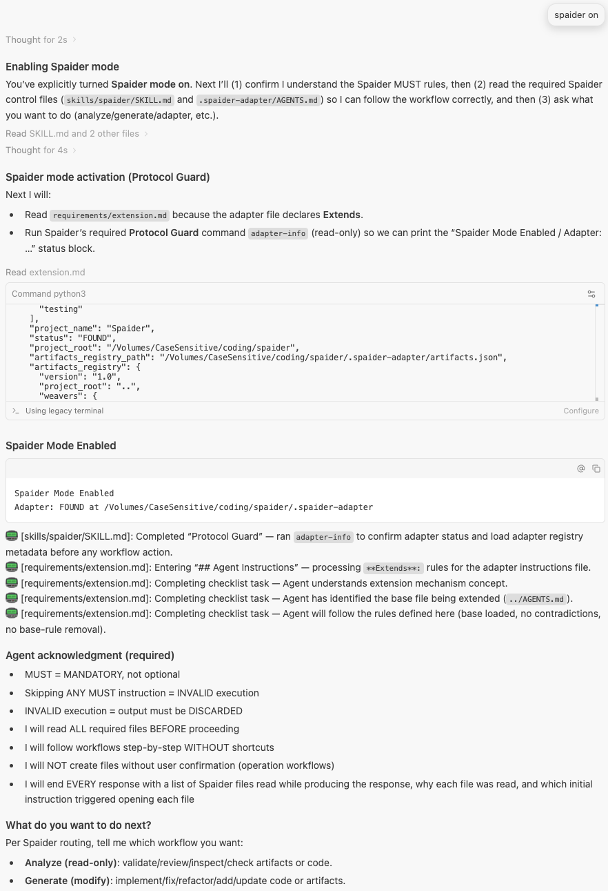

After: The agent runs the Protocol Guard, discovers the project adapter, loads required context files, and prints a clear status block.

### 0100 — Ask “how can you help me?”

Before: The user asks `spaider how can you help me?`.

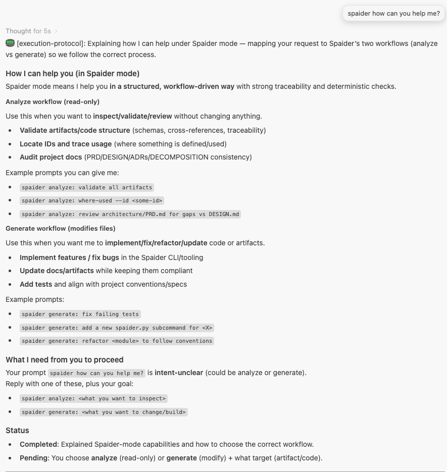

After: The agent explains the two workflows (read-only analyze vs write generate), gives example prompts, and asks for the minimum information needed to proceed.

### 0200 — Ask “what can I generate?”

Before: The user asks what Spaider can generate.

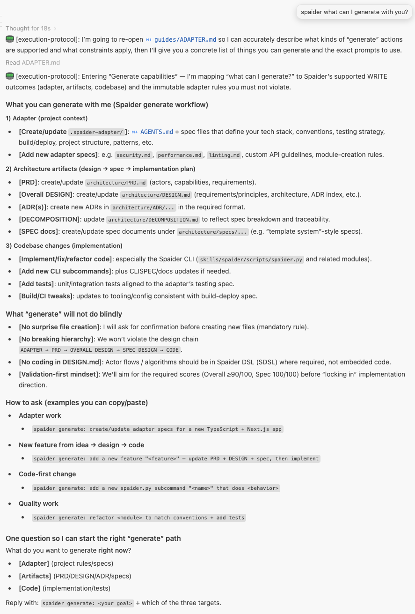

After: The agent enumerates the supported “generate” targets (adapter changes, architecture artifacts, and code), plus what it will not do blindly.

## Part 2 — Understand analyze vs generate (0300–0500)

### Analyze workflow tour (0300–0310)

#### 0300 — Ask “what can you analyze?”

Before: The user asks what “analyze” supports.

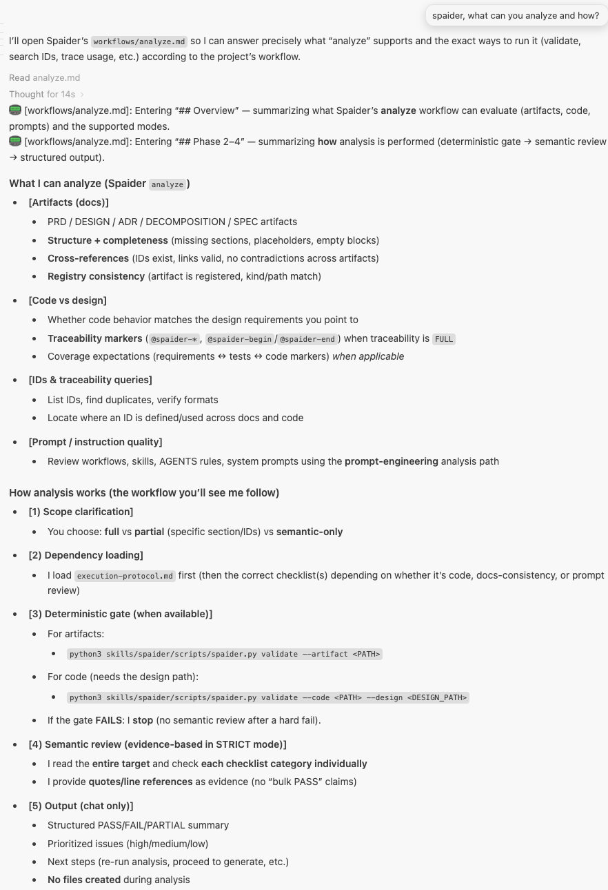

After: The agent maps analysis into concrete buckets (artifacts, code-vs-design, IDs/traceability, prompt review) and explains the analysis workflow.

#### 0310 — How to ask for analysis (examples)

Before: The user wants actionable examples of how to request analysis.

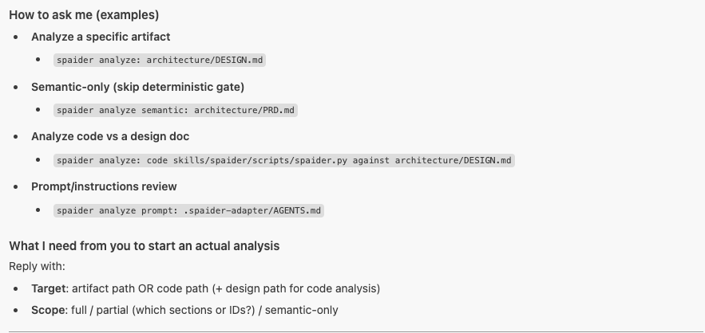

After: The agent provides copy/paste prompt patterns and clarifies the minimal inputs required to start an analysis.

### Terminology tour (0400–0500)

#### 0400 — Ask “what is an artifact?”

Before: The user asks what Spaider means by “artifact”.

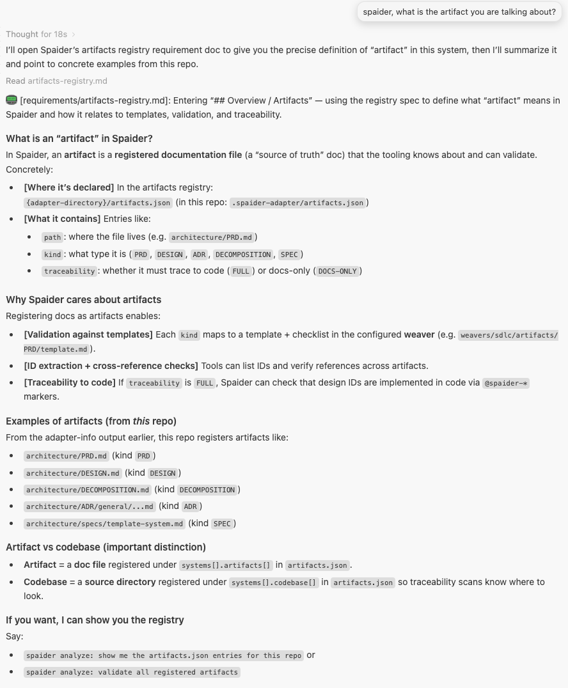

After: The agent defines an artifact as a registered, tooling-aware documentation file and explains how registration enables deterministic validation and traceability.

#### 0500 — Ask “configured weaver—what is that?”

Before: The user asks what a “configured weaver” means.

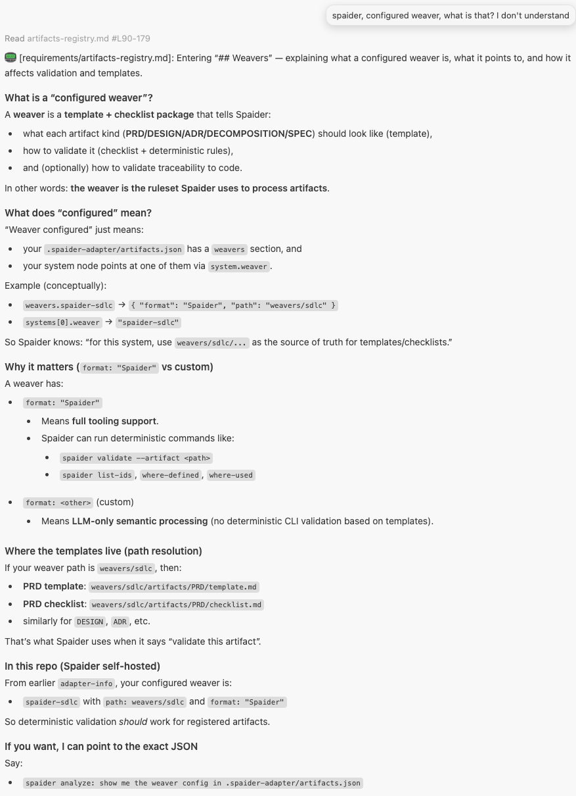

After: The agent explains that a weaver is the templates + checklists package that powers validation and generation, and how systems point at a weaver.

## Part 3 — Turn an idea into a scoped plan (0600–0801)

### Idea + clarification (0600–0601)

#### 0600 — A real feature idea appears

Before: The user proposes a concrete idea: a macOS tool that alerts when they work too long, with configurable limits.

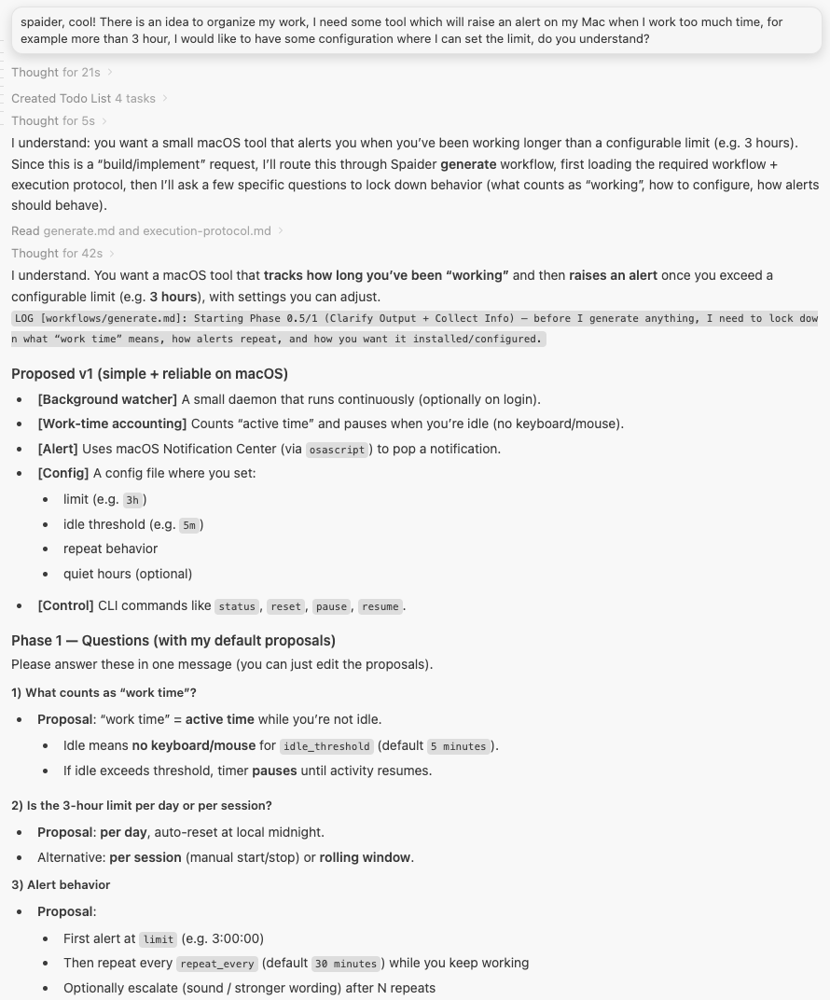

After: The agent routes the request into the generate workflow and asks structured clarification questions before creating any files.

#### 0601 — Confirm configuration + runtime decisions

Before: The user needs to decide where configuration lives and how the tool runs.

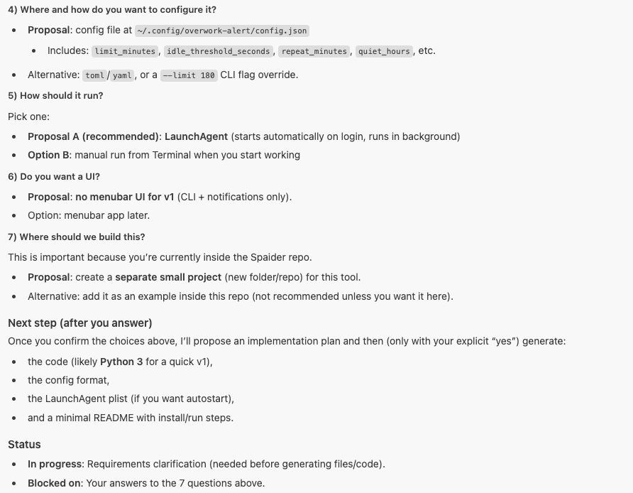

After: The agent proposes a practical v1 config location/format, running options, and explicitly states what it will generate once the user confirms.

### Scope decision + write gate (0700–0701)

#### 0700 — User approves most proposals

Before: The user approves the plan and asks to add the tool inside this repo as an example.

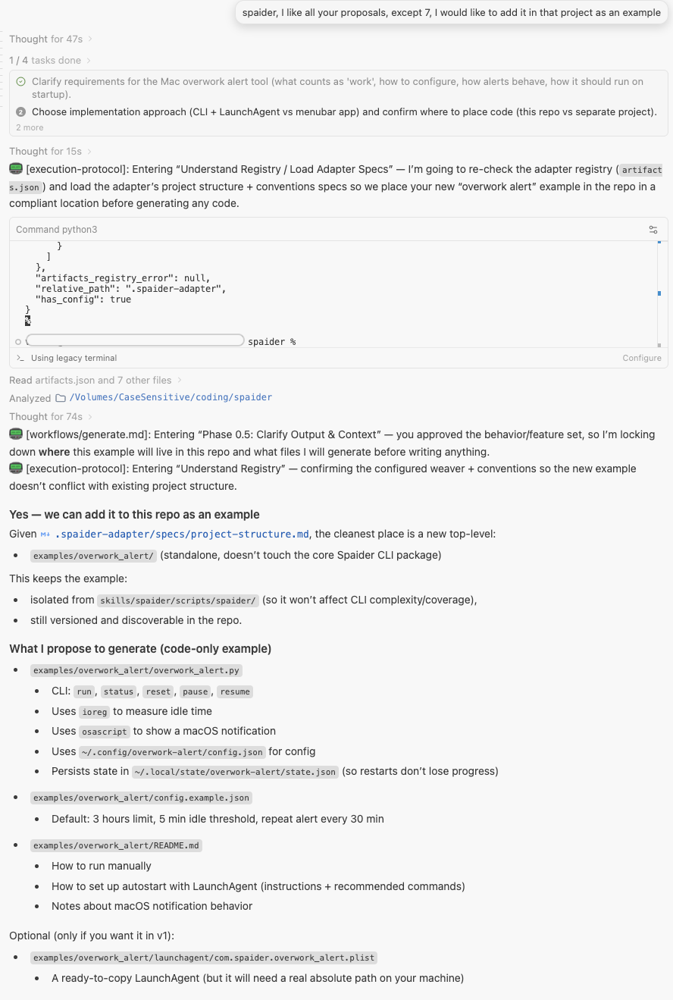

After: The agent re-checks registry + project structure conventions and proposes a compliant location under `examples/`.

#### 0701 — The agent asks for a scoped decision + write confirmation

Before: The agent needs a scope choice (small code-only vs full SDLC example) and explicit permission to write files.

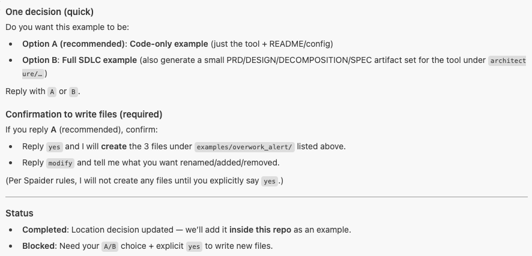

After: The agent blocks on a clear A/B decision and an explicit “yes” before creating anything.

### Compare options (0800–0801)

#### 0800 — User asks for help comparing options

Before: The user can’t decide between Option A and B.

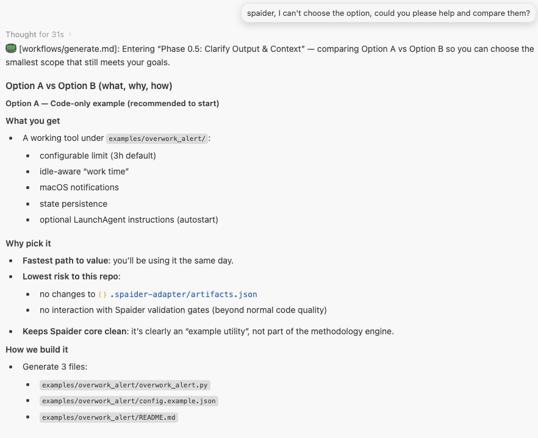

After: The agent compares options in terms of value, risk, and repo impact—so the user can choose the smallest scope that meets their goal.

#### 0801 — Option B details (full SDLC example)

Before: The user wants to understand what the “full SDLC” path adds.

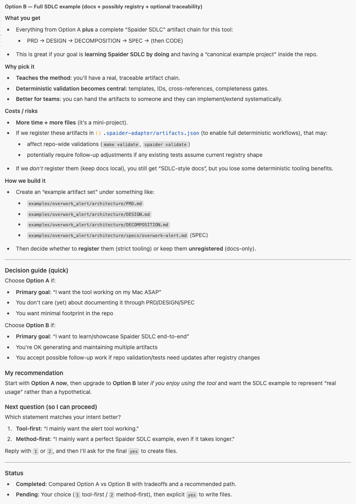

After: The agent explains that Option B adds the PRD → DESIGN → DECOMPOSITION → SPEC chain (plus optional registry updates), including the tradeoffs.

## Part 4 — Draft the PRD (0900–0904)

### PRD drafting (0900–0904)

#### 0900 — User chooses to learn SDLC end-to-end

Before: The user chooses the “showcase Spaider SDLC end-to-end” path.

After: The agent loads weaver rules/templates and starts structured PRD input collection, including ID + file placement proposals.

#### 0901 — PRD overview inputs

Before: The PRD needs an overview, context, users, and success criteria.

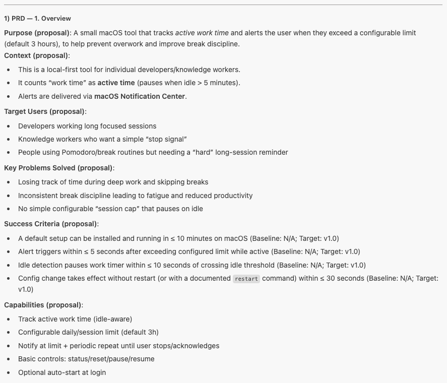

After: The agent provides concrete proposed PRD content for approval (not open-ended), aligned with the PRD template.

#### 0902 — PRD actors + functional requirements

Before: The PRD must define actors and functional requirements.

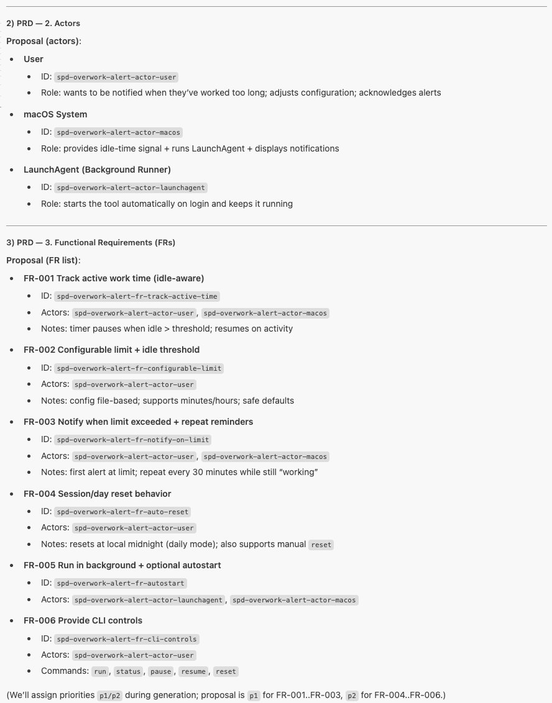

After: The agent proposes actor definitions and a numbered FR set with stable IDs for later traceability.

#### 0903 — PRD use cases + NFRs

Before: The PRD needs use cases and non-functional requirements.

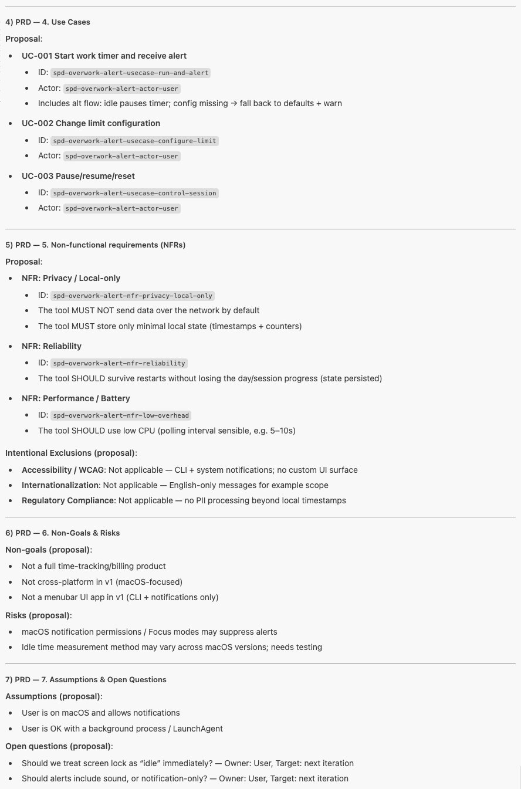

After: The agent proposes use cases, privacy/reliability/performance NFRs, and keeps the scope explicit with non-goals.

#### 0904 — Approval format and next stage

Before: The user needs to know how to approve the PRD inputs.

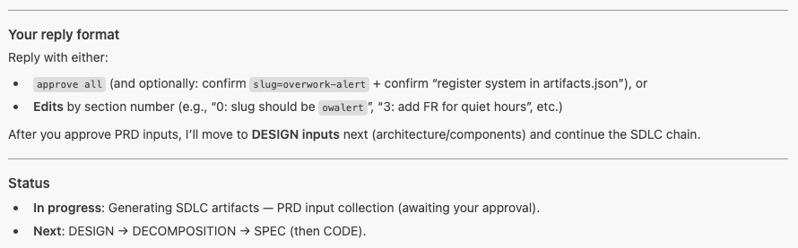

After: The agent provides a clear reply format (“approve all” or section edits) and explains what happens next (DESIGN → DECOMPOSITION → SPEC).

## Part 5 — Write PRD and move into design (1000–1201)

### Write to disk + validate (1000–1100)

#### 1000 — User approves PRD inputs

Before: The user approves the PRD proposals.

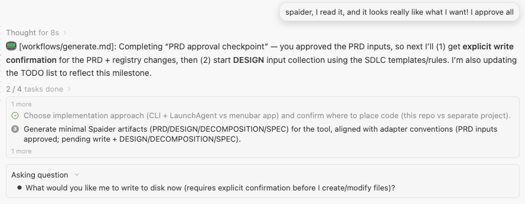

After: The agent acknowledges the checkpoint and asks what (if anything) should be written to disk now—still gated behind explicit confirmation.

#### 1001 — Write options presented

Before: The user is asked to choose what to write.

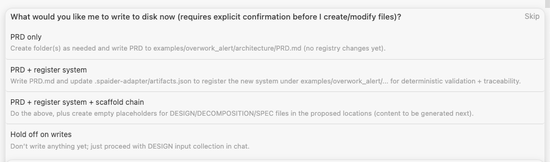

After: The agent offers scoped write choices (PRD only vs PRD + registry vs hold off) and keeps the operation reversible.

#### 1002 — Writing to disk (gated) + registry update

Before: The user chooses to write PRD + register the system.

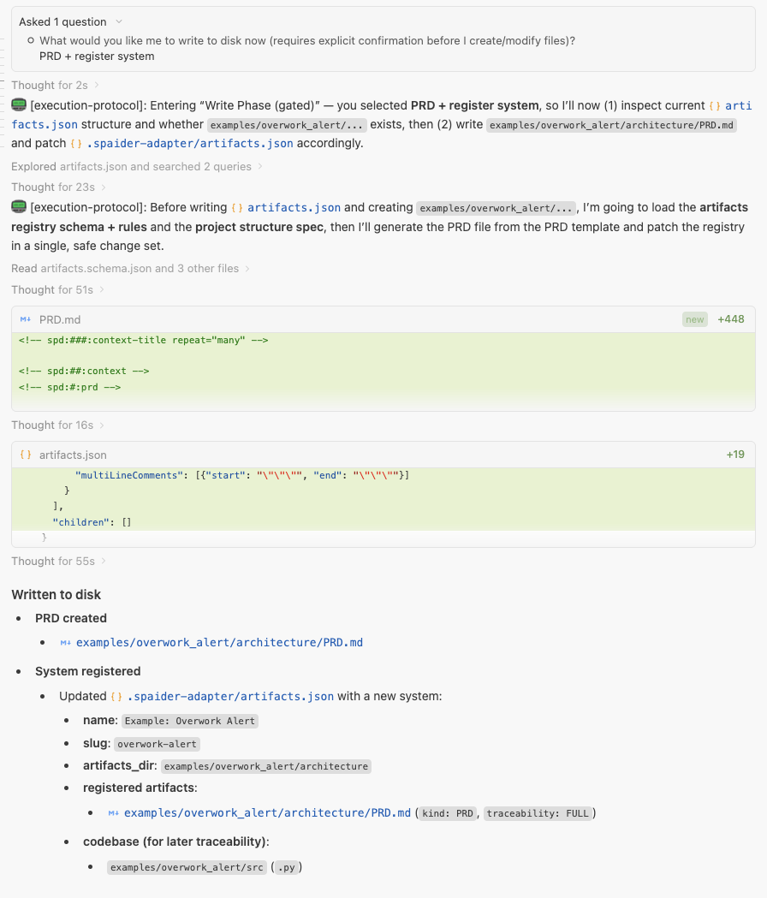

After: The agent writes the PRD and patches the registry to register the new system, making downstream validation/traceability deterministic.

Links:

- PRD: [PRD.md](../examples/overwork_alert/architecture/PRD.md)
- Registry: [artifacts.json](../.spaider-adapter/artifacts.json)

#### 1003 — Next steps: validation + DESIGN

Before: After writing, the user needs the next action.

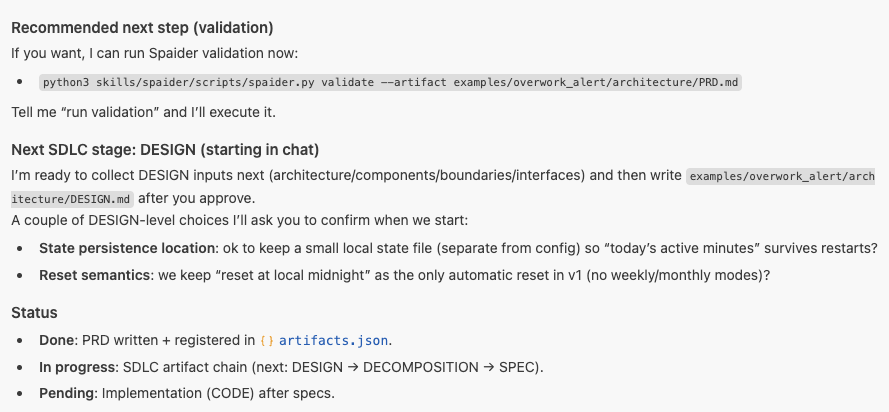

After: The agent proposes validation of the written PRD and starts collecting DESIGN decisions for the next artifact stage.

#### 1100 — Proceed with validation and DESIGN setup

Before: The user asks the agent to proceed following recommendations.

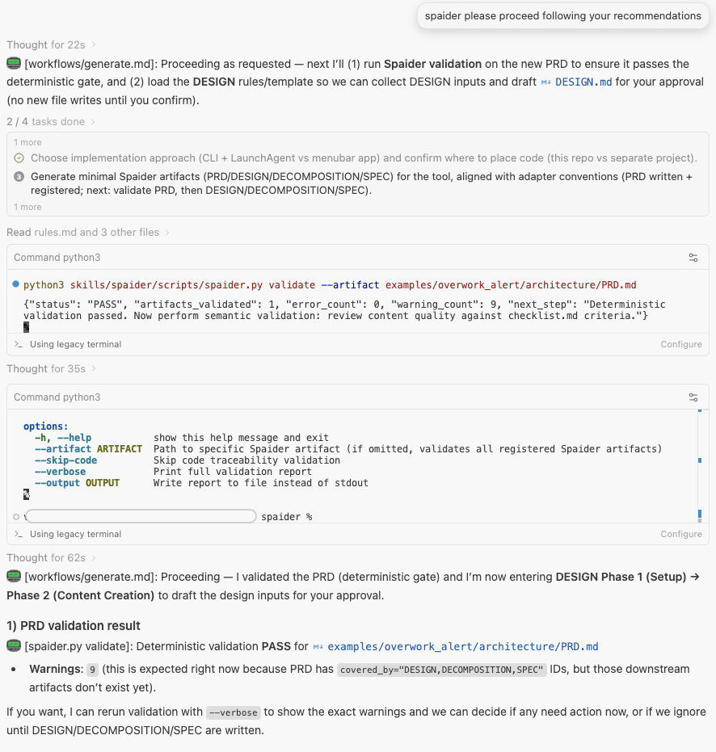

After: The agent runs deterministic PRD validation, reports results, and then transitions into DESIGN input collection.

### Design inputs (1101–1201)

#### 1101 — DESIGN decisions (inputs)

Before: The DESIGN needs a few key architectural decisions.

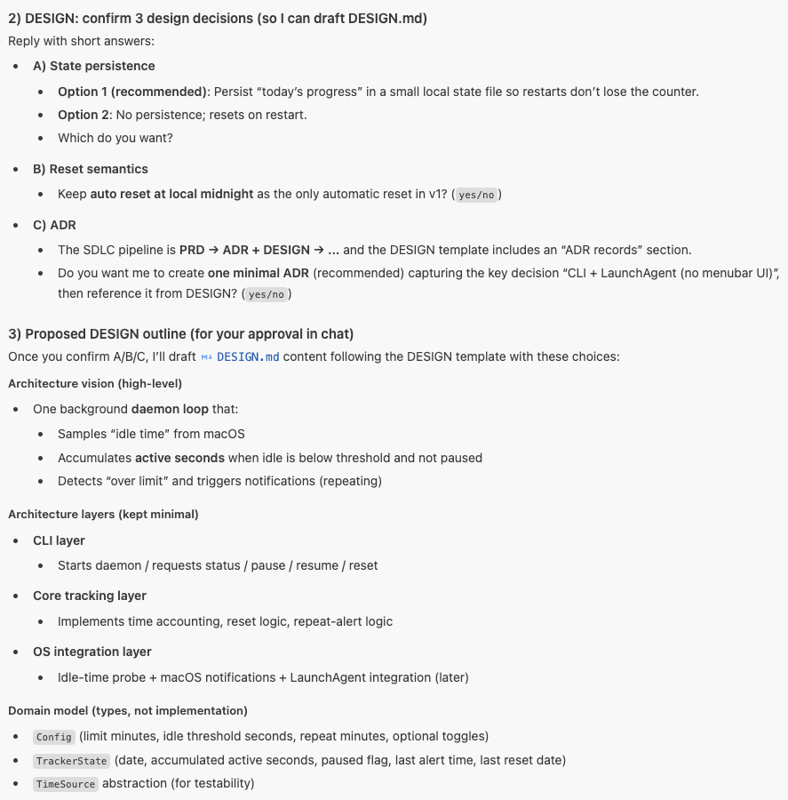

After: The agent asks a small set of targeted questions (with suggested defaults) to lock down the design before drafting.

#### 1102 — DESIGN components and sequences

Before: The user needs to understand what the resulting design will cover.

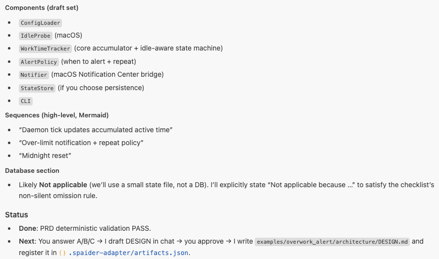

After: The agent proposes a minimal component set + sequences to keep the design both clear and implementable.

#### 1200 — Decisions recorded + alignment checks

Before: The user answers the DESIGN decision questions.

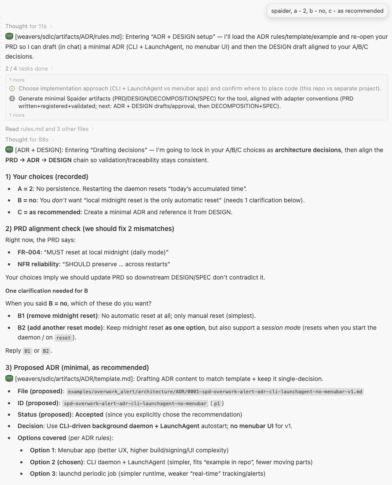

After: The agent records the choices, checks for PRD/design mismatches that would cause contradictions, and asks one final clarification to keep the artifact chain consistent.

#### 1201 — DESIGN draft direction + next write gate

Before: The agent needs one last confirmation on a couple of design constraints (and how the CLI will control the daemon) before it can draft and write the DESIGN artifact.

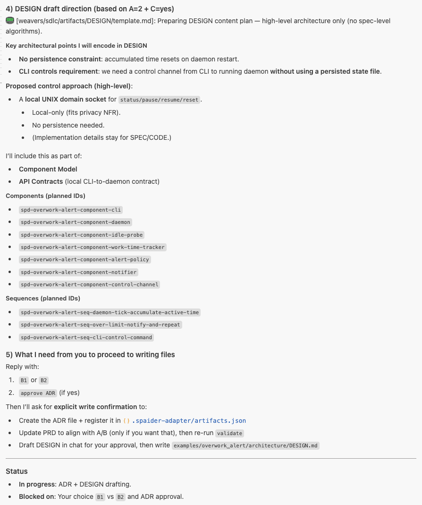

After: The agent proposes a high-level control approach (local UNIX socket), outlines planned components and sequences, and clearly asks for the remaining choices required before writing files.

## Part 6 — ADR + DESIGN + DECOMPOSITION + SPEC (1300–1309)

### ADR creation + validation loop (1300–1302)

#### 1300 — Approve ADR direction + confirm what to write

Before: The user chooses an option (B1) and approves the ADR direction.

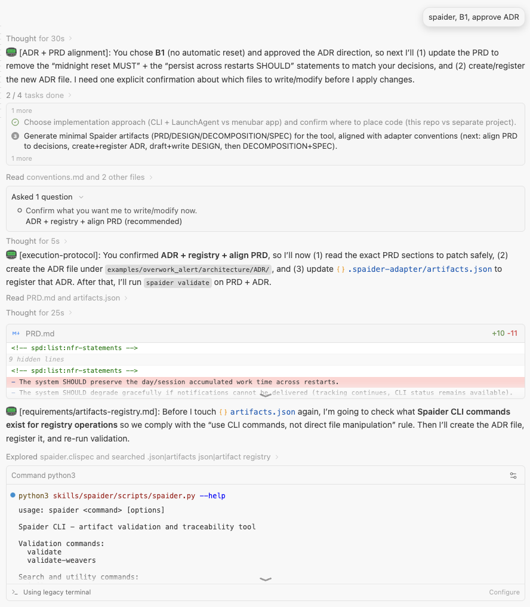

After: The agent aligns PRD statements to the decision, then pauses for an explicit write confirmation about exactly which files will be created/modified.

#### 1301 — ADR created, registered, and validated (first failure)

Before: The agent proceeds to create the ADR file, register it in the registry, and run deterministic validation.

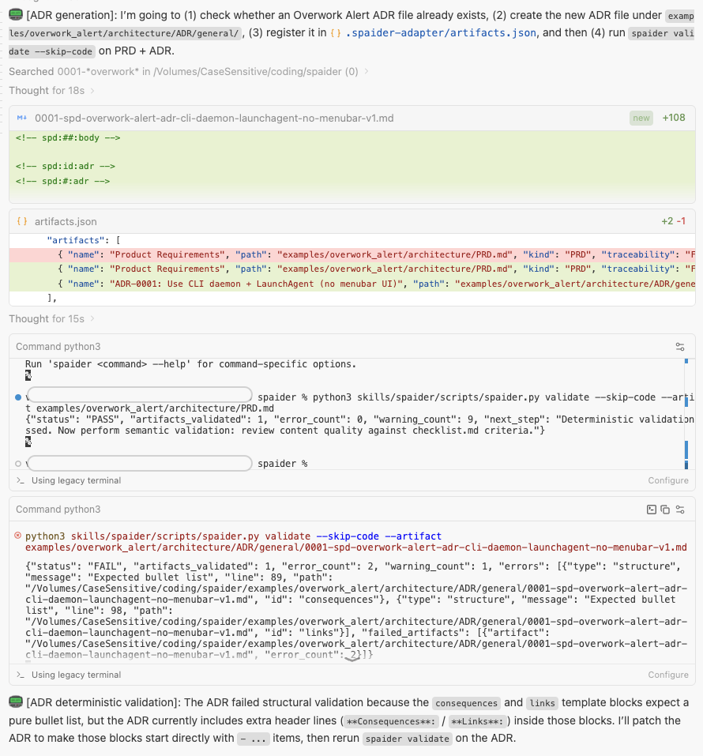

After: Validation fails for a precise structural reason (template blocks expecting a pure bullet list). The agent explains the failure and proposes a minimal patch.

Links:

- ADR: [0001-spd-overwork-alert-adr-cli-daemon-launchagent-no-menubar-v1.md](../examples/overwork_alert/architecture/ADR/general/0001-spd-overwork-alert-adr-cli-daemon-launchagent-no-menubar-v1.md)
- Registry: [artifacts.json](../.spaider-adapter/artifacts.json)

#### 1302 — ADR structural fix + validation pass

Before: The agent patches the ADR to satisfy the validator’s structure requirements.

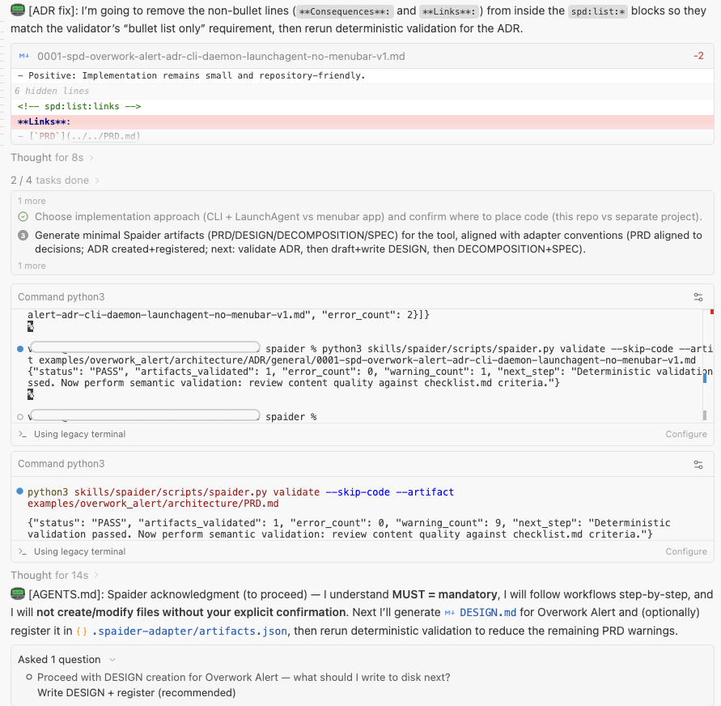

After: Deterministic validation passes for both ADR and PRD. The agent then re-states the next step (DESIGN) and gates the next write behind an explicit confirmation.

Links:

- PRD: [PRD.md](../examples/overwork_alert/architecture/PRD.md)
- ADR: [0001-spd-overwork-alert-adr-cli-daemon-launchagent-no-menubar-v1.md](../examples/overwork_alert/architecture/ADR/general/0001-spd-overwork-alert-adr-cli-daemon-launchagent-no-menubar-v1.md)

### DESIGN creation + template compliance (1303–1304)

#### 1303 — DESIGN created + validation failure identifies missing required blocks

Before: The agent creates the DESIGN artifact, registers it, and runs deterministic validation.

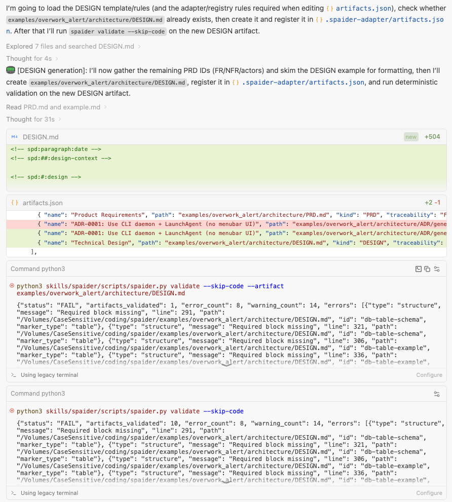

After: Validation fails with a list of specific missing required template blocks. The agent treats it as a template-compliance issue (not a “guess”) and prepares a targeted patch.

Links:

- DESIGN: [DESIGN.md](../examples/overwork_alert/architecture/DESIGN.md)
- Registry: [artifacts.json](../.spaider-adapter/artifacts.json)

#### 1304 — DESIGN patched to match template + validation pass

Before: The agent adds the missing required table sections/blocks to match the DESIGN template.

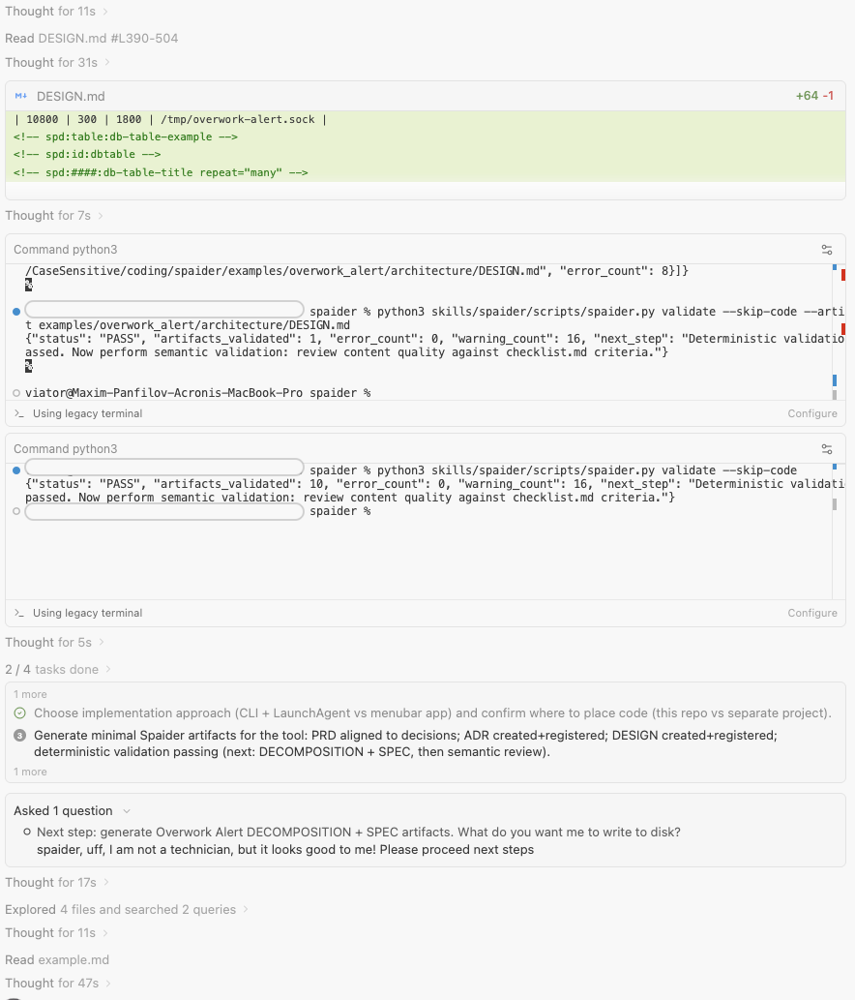

After: Deterministic validation passes. The agent summarizes progress and asks what to write next (DECOMPOSITION + SPEC), keeping control with the user.

Links:

- DESIGN: [DESIGN.md](../examples/overwork_alert/architecture/DESIGN.md)

### DECOMPOSITION + SPEC set + validation (1305–1309)

#### 1305 — DECOMPOSITION + SPEC generation (registered + validated)

Before: The user asks to proceed with the next steps.

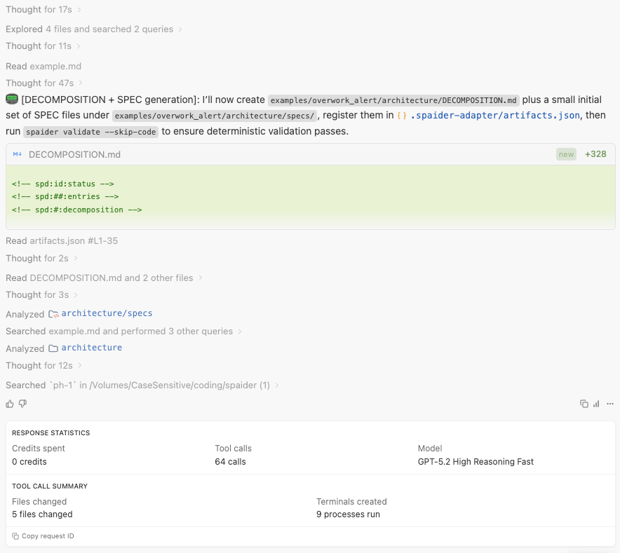

After: The agent creates the DECOMPOSITION artifact and an initial set of SPEC files, registers them in the registry, and re-runs deterministic validation to ensure the new artifacts are structurally compliant.

Links:

- DECOMPOSITION: [DECOMPOSITION.md](../examples/overwork_alert/architecture/DECOMPOSITION.md)
- Specs directory: [architecture/specs/](../examples/overwork_alert/architecture/specs/)
- Registry: [artifacts.json](../.spaider-adapter/artifacts.json)

#### 1306 — Generate the remaining SPEC set + register in registry

Before: The agent proceeds to generate the remaining artifacts: a DECOMPOSITION entry list and a small set of SPEC documents (tracker core, notifications, CLI control, and LaunchAgent autostart).

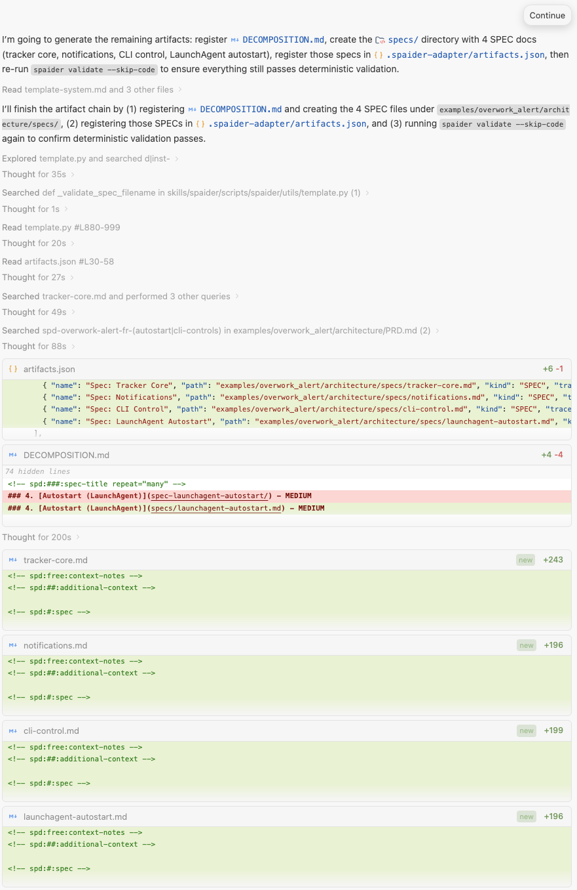

After: The agent creates the SPEC files under `architecture/specs/`, registers them in `.spaider-adapter/artifacts.json`, and updates DECOMPOSITION to include the new units.

Links:

- DECOMPOSITION: [DECOMPOSITION.md](../examples/overwork_alert/architecture/DECOMPOSITION.md)
- SPEC: [tracker-core.md](../examples/overwork_alert/architecture/specs/tracker-core.md)
- SPEC: [notifications.md](../examples/overwork_alert/architecture/specs/notifications.md)
- SPEC: [cli-control.md](../examples/overwork_alert/architecture/specs/cli-control.md)
- SPEC: [launchagent-autostart.md](../examples/overwork_alert/architecture/specs/launchagent-autostart.md)
- Registry: [artifacts.json](../.spaider-adapter/artifacts.json)

#### 1307 — Deterministic validation finds SPEC filename/ID mismatches

Before: The agent runs deterministic validation on the newly created SPEC files.

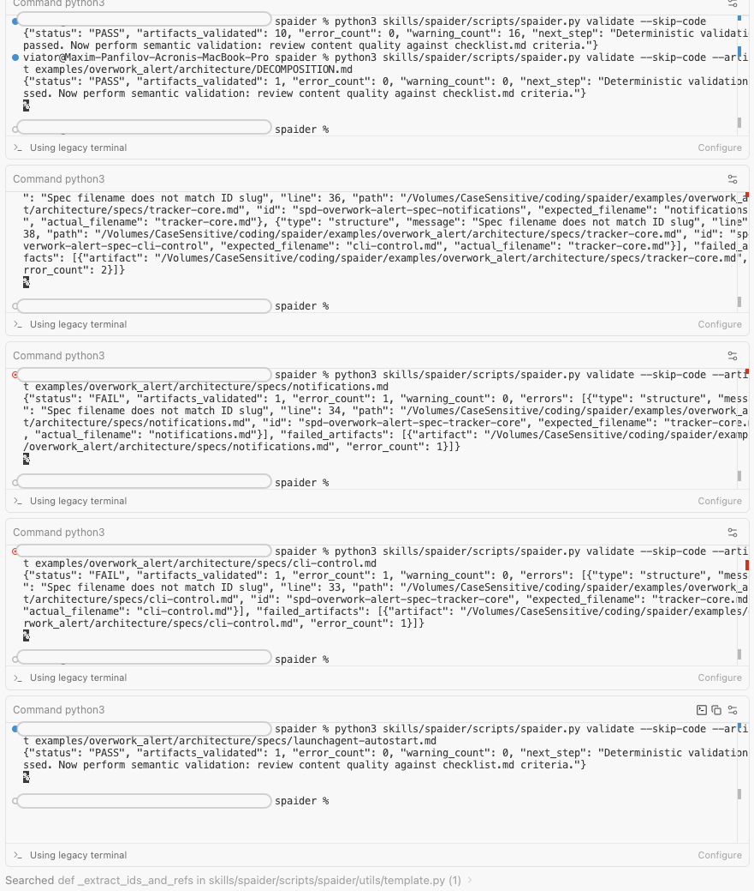

After: Validation fails for some SPECs with a precise, actionable error: the expected filename (derived from the spec’s ID/slug) does not match the actual file name. This demonstrates how Spaider’s validator catches structural inconsistencies early and forces a minimal, targeted fix.

#### 1308 — Fix SPEC references/structure + validation passes

Before: After a SPEC validation failure, the agent applies a minimal patch to make the SPECs unambiguous for deterministic rules (without changing their meaning).

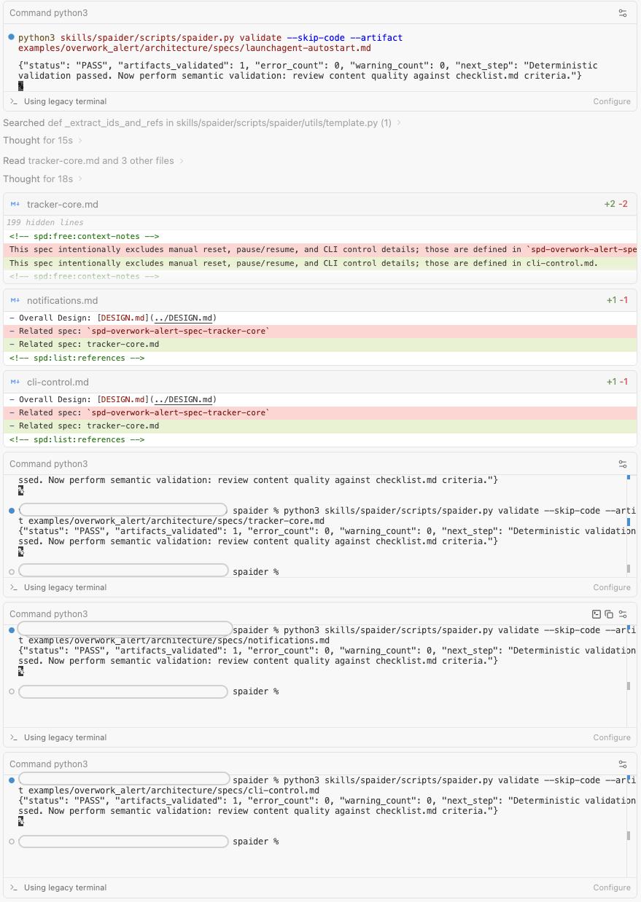

After: The agent reruns deterministic validation on each SPEC and gets clean PASS results, demonstrating the “tight feedback loop” between templates, IDs, filenames, and references.

Links:

- DECOMPOSITION: [DECOMPOSITION.md](../examples/overwork_alert/architecture/DECOMPOSITION.md)
- SPEC: [tracker-core.md](../examples/overwork_alert/architecture/specs/tracker-core.md)
- SPEC: [notifications.md](../examples/overwork_alert/architecture/specs/notifications.md)
- SPEC: [cli-control.md](../examples/overwork_alert/architecture/specs/cli-control.md)
- SPEC: [launchagent-autostart.md](../examples/overwork_alert/architecture/specs/launchagent-autostart.md)
- Registry: [artifacts.json](../.spaider-adapter/artifacts.json)

#### 1309 — Completion summary + clear next step

Before: The user needs to know what was created/changed and what comes next.

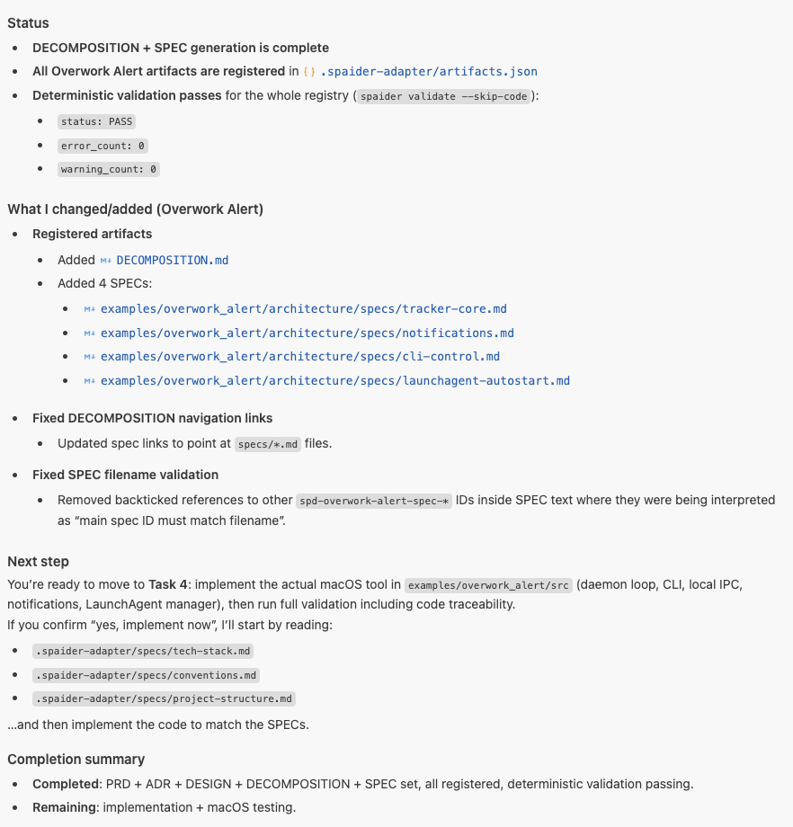

After: The agent summarizes what it added (DECOMPOSITION + SPEC set, all registered), confirms the registry passes deterministic validation, and proposes the next milestone: implementing the actual macOS tool (code) with another explicit write gate.

## Part 7 — Review SPECs (plain-language + expert issues-only) (1400–1503)

### Plain-language SPEC walkthrough (1400–1403)

#### 1400 — User asks for a plain-language review of the SPECs

Before: The user says they’re not sure they understand the SPEC files and asks the agent to review them.

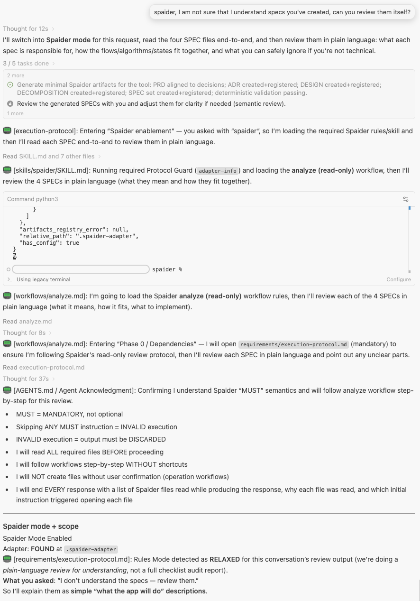

After: The agent routes the request to the **analyze (read-only)** workflow, loads required context (Protocol Guard), and explains it will review each SPEC end-to-end in plain language.

#### 1401 — Explain “what a SPEC is” + review tracker-core in human terms

Before: The user needs a mental model of what a SPEC means, and what the first SPEC (“tracker core”) is responsible for.

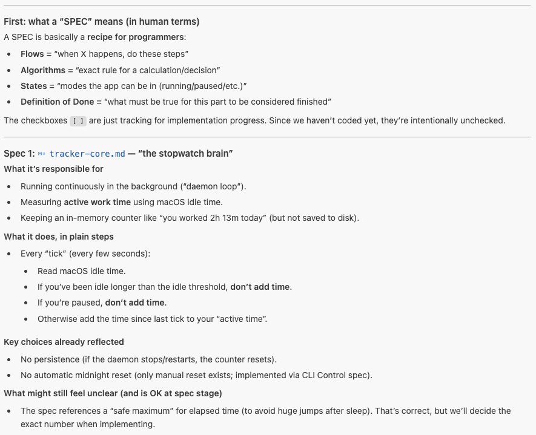

After: The agent explains SPEC concepts (flows/algorithms/states/done) and then rewrites the tracker-core spec as simple “what the app does” steps, while keeping constraints (no persistence, no midnight reset) explicit.

#### 1402 — Review notifications + CLI control SPECs (plain language)

Before: The user needs the remaining SPECs explained without implementation details.

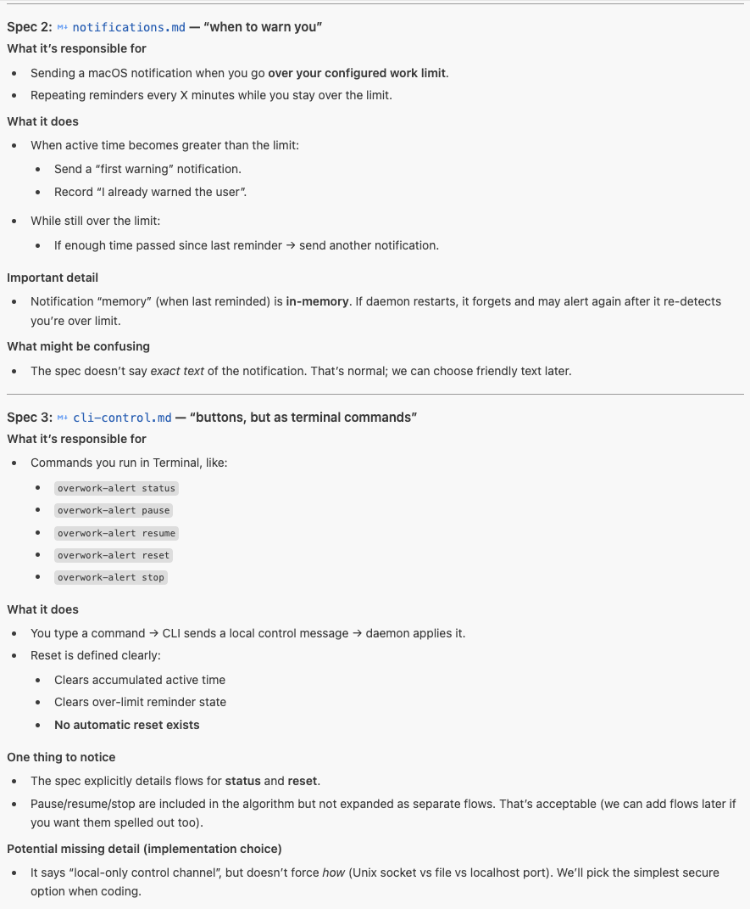

After: The agent summarizes the notifications behavior (“when to warn you”) and the CLI control behavior (“buttons as terminal commands”), highlighting what is defined vs what can be decided later during implementation.

#### 1403 — Review LaunchAgent autostart + how the SPECs fit together

Before: The user needs the final SPEC explained, plus an overall picture of how everything connects.

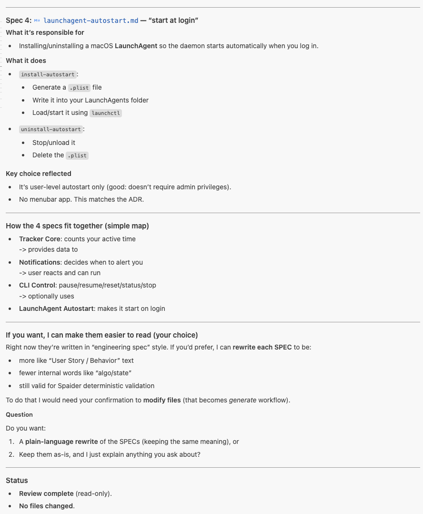

After: The agent explains the LaunchAgent autostart responsibilities and provides a simple dependency map of the four SPECs. It also offers an optional rewrite of the SPECs into more “user-story” language, explicitly noting that rewriting would require a generate (write) confirmation.

### Expert issues-only review (1500–1503)

#### 1500 — Request an expert review (issues-only, no file edits)

Before: The user asks for an expert-level review of the created SPECs.

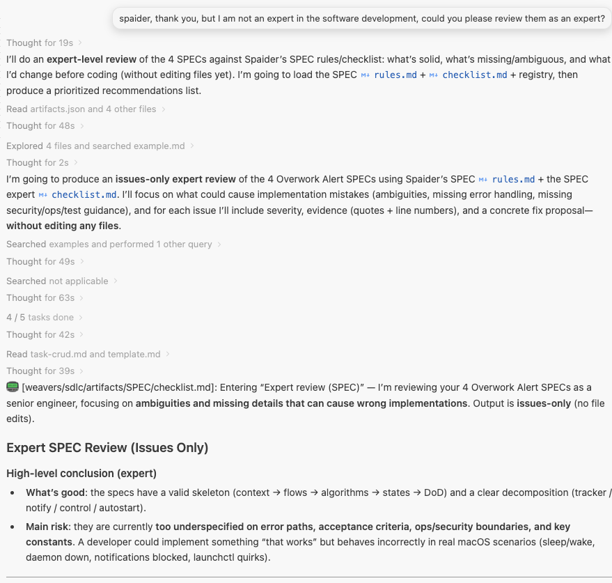

After: The agent switches to an **issues-only** evaluation against Spaider’s SPEC rules/checklist, explicitly promising **not** to edit files. It loads the relevant checklist/rules and produces a prioritized list of risks and gaps.

#### 1501 — Critical issues: edge cases, acceptance criteria, and explicit non-applicable domains

Before: The user needs to understand what is “missing” before coding starts.

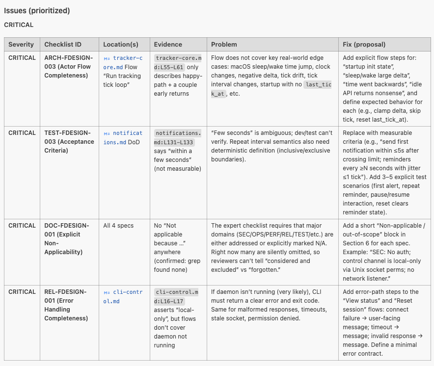

After: The agent reports critical issues with severity, evidence, and concrete fix proposals (e.g., sleep/wake time-jump handling, measurable acceptance criteria for notifications, explicit “not applicable” notes for SEC/OPS/PERF/REL domains, and CLI error-path completeness).

#### 1502 — High issues: security constraints, configuration defaults, and algorithm constants

Before: The user needs a deeper pass on non-critical but high-risk ambiguities.

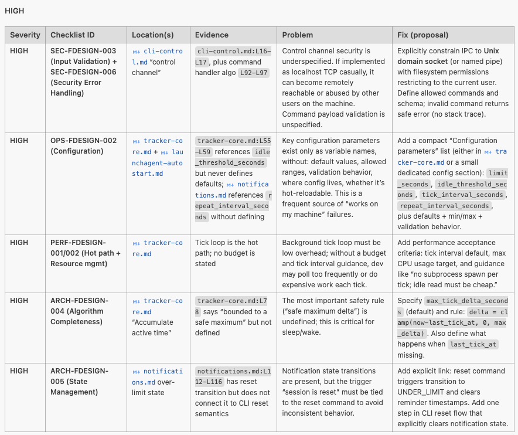

After: The agent flags high-priority gaps like IPC security constraints, missing config defaults/ranges/validation, performance guidance for hot loops, and undefined constants (e.g., max tick delta). Each item comes with an implementation-agnostic fix suggestion.

#### 1503 — Medium issues + recommended path forward (revise specs vs start coding)

Before: The user wants a practical recommendation on what to do next.

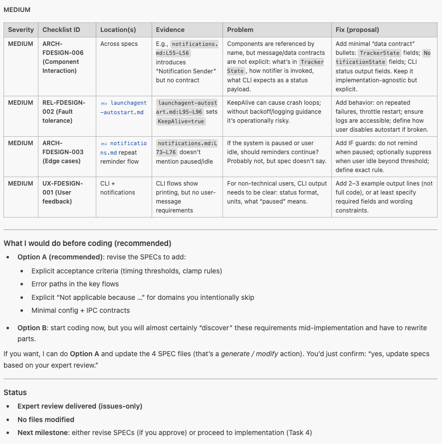

After: The agent summarizes medium issues (data contracts, fault-tolerance/backoff, UX clarity) and recommends either:

- Option A: revise the SPECs first to add missing acceptance criteria/error paths/contracts, or
- Option B: start implementation now (with an explicit warning that these requirements will surface later).

It keeps the write gate explicit: updating the SPEC files requires a new generate confirmation.

## Part 8 — Apply SPEC gap fixes (Option A) (1600–1604)

### Option A: apply SPEC gap fixes (1600–1601)

#### 1600 — Choose Option A: apply SPEC gap fixes (write workflow)

Before: The user chooses Option A to fix the gaps and asks for a stable, useful tool.

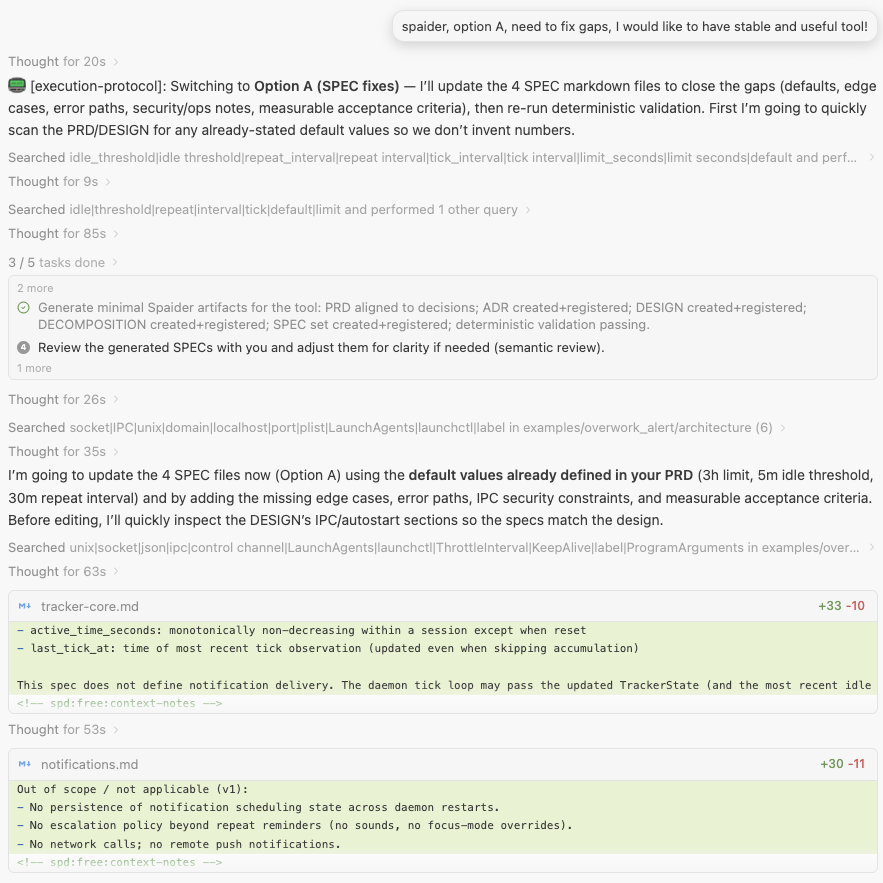

After: The agent updates the SPECs to close the review gaps (defaults, edge cases, error paths, out-of-scope notes, and measurable acceptance criteria), using values already defined in PRD/DESIGN where possible.

Links:

- PRD: [PRD.md](../examples/overwork_alert/architecture/PRD.md)
- DESIGN: [DESIGN.md](../examples/overwork_alert/architecture/DESIGN.md)
- SPEC: [tracker-core.md](../examples/overwork_alert/architecture/specs/tracker-core.md)
- SPEC: [notifications.md](../examples/overwork_alert/architecture/specs/notifications.md)

#### 1601 — Recovery: re-enter Protocol Guard + finish remaining SPEC patches

Before: The agent notices it started edits before completing the required Protocol Guard, and corrects course.

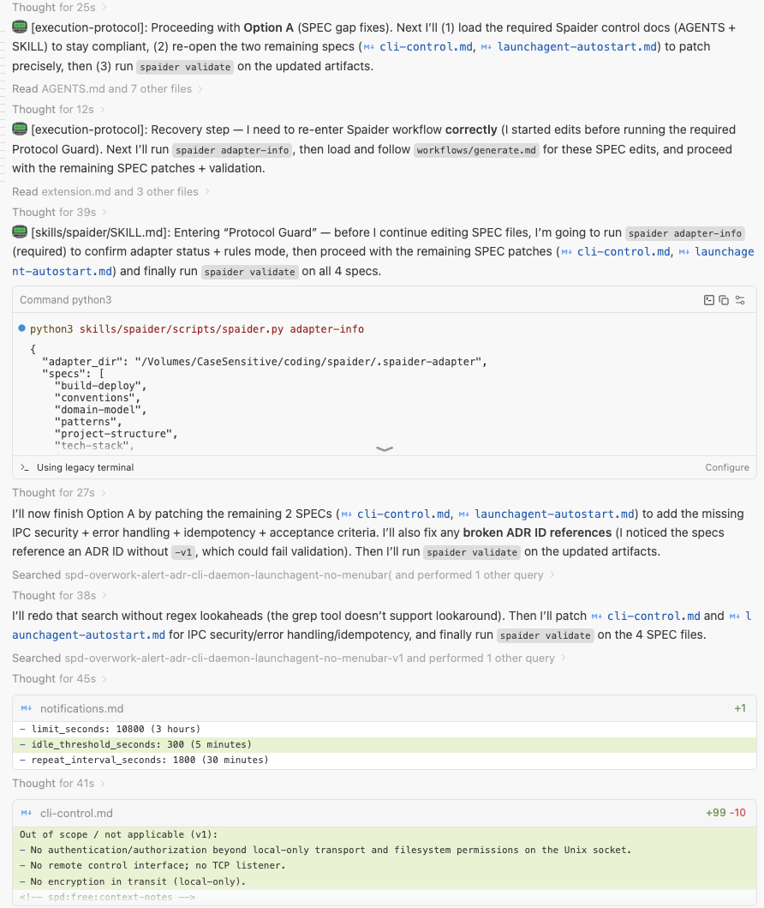

After: The agent runs `adapter-info`, re-enters the generate workflow properly, then patches the remaining SPECs and plans a full deterministic validation pass.

Links:

- SPEC: [cli-control.md](../examples/overwork_alert/architecture/specs/cli-control.md)
- SPEC: [launchagent-autostart.md](../examples/overwork_alert/architecture/specs/launchagent-autostart.md)

### Validation loop until PASS (1602–1604)

#### 1602 — Validate updated SPECs + tighten failure-handling and “out of scope” notes

Before: The agent completes the remaining SPEC edits and begins deterministic validation to confirm template compliance.

After: Several SPEC validations pass; the remaining issues are treated as strict template/marker requirements, with the next patch focused only on what the validator reports.

Links:

- SPEC: [tracker-core.md](../examples/overwork_alert/architecture/specs/tracker-core.md)
- SPEC: [notifications.md](../examples/overwork_alert/architecture/specs/notifications.md)
- SPEC: [cli-control.md](../examples/overwork_alert/architecture/specs/cli-control.md)
- SPEC: [launchagent-autostart.md](../examples/overwork_alert/architecture/specs/launchagent-autostart.md)

#### 1603 — Fix remaining validation errors (missing required coverage blocks)

Before: One SPEC still fails deterministic validation due to missing required marker blocks.

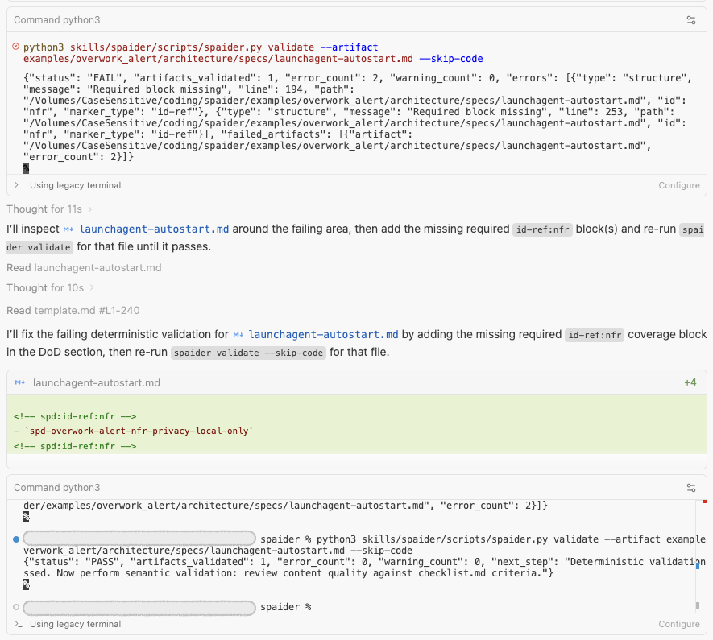

After: The agent adds the missing required coverage block(s) and reruns deterministic validation until it passes.

Links:

- SPEC: [launchagent-autostart.md](../examples/overwork_alert/architecture/specs/launchagent-autostart.md)

#### 1604 — SPEC gap fixes complete + deterministic validation PASS

Before: After iterating, the user needs a clear summary and next choices.

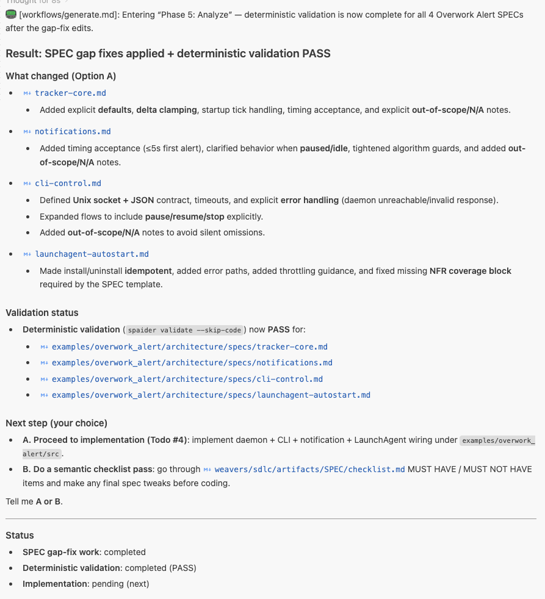

After: The agent summarizes what changed in each SPEC and confirms deterministic validation passes across all updated SPECs, then offers the next step: proceed to implementation, or do a semantic checklist pass.

Links:

- SPEC: [tracker-core.md](../examples/overwork_alert/architecture/specs/tracker-core.md)
- SPEC: [notifications.md](../examples/overwork_alert/architecture/specs/notifications.md)
- SPEC: [cli-control.md](../examples/overwork_alert/architecture/specs/cli-control.md)
- SPEC: [launchagent-autostart.md](../examples/overwork_alert/architecture/specs/launchagent-autostart.md)
- Registry: [artifacts.json](../.spaider-adapter/artifacts.json)

## Part 9 — Implement the tool + tests (1700–1901)

### Implementation kickoff + codebase layout (1700–1702)

#### 1700 — User asks to implement

Before: The user decides to proceed from architecture artifacts into code and asks to implement the tool.

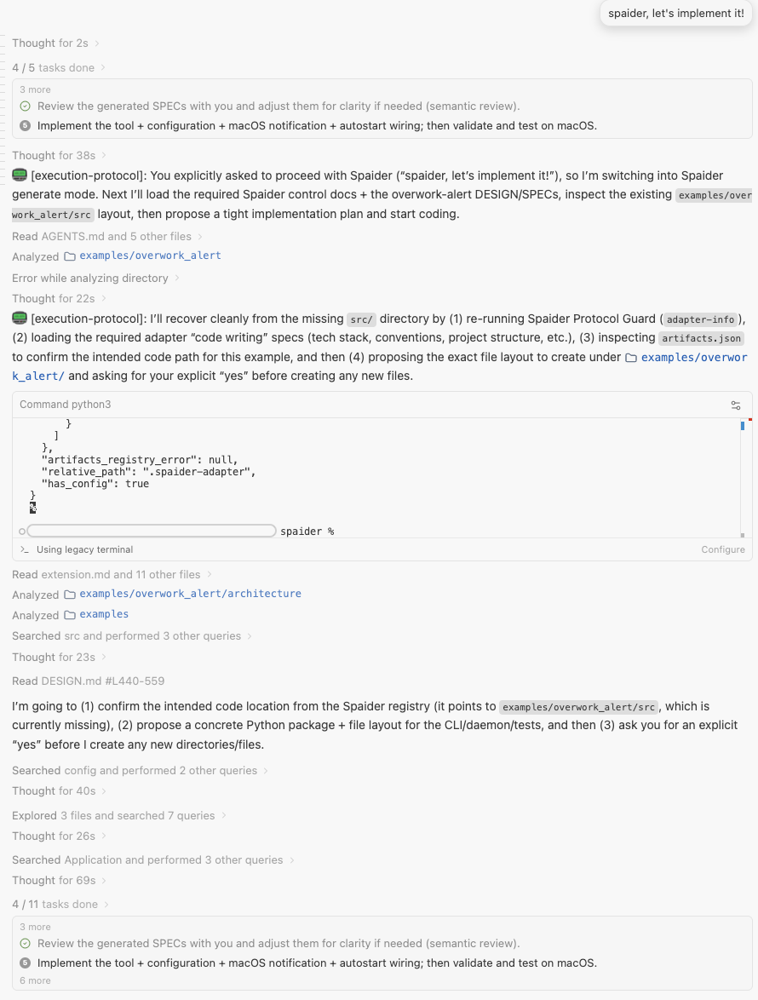

After: The agent switches to generate mode for the codebase, runs Protocol Guard, and recovers cleanly when it discovers the expected `examples/overwork_alert/src/` directory does not exist yet.

Links:

- Codebase root (to be created): [examples/overwork_alert/src/](../examples/overwork_alert/src/)

#### 1701 — Propose exact file layout for stdlib-only implementation

Before: The agent needs to avoid guessing where code should live and which files must exist for CLI/daemon/IPC/autostart.

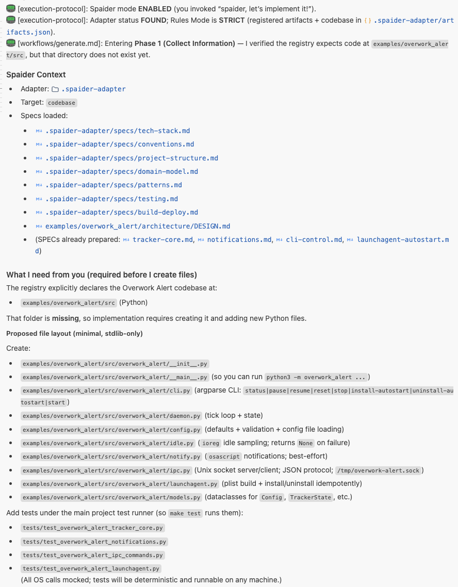

After: The agent proposes a minimal, stdlib-only Python package layout and a small deterministic test suite that can run on any machine (mocking OS calls where needed).

Links:

- Code package: [overwork_alert/](../examples/overwork_alert/src/overwork_alert/)

#### 1702 — One decision: default config path + explicit confirmation to write

Before: The DESIGN/SPEC define what configuration contains, but not the exact default path.

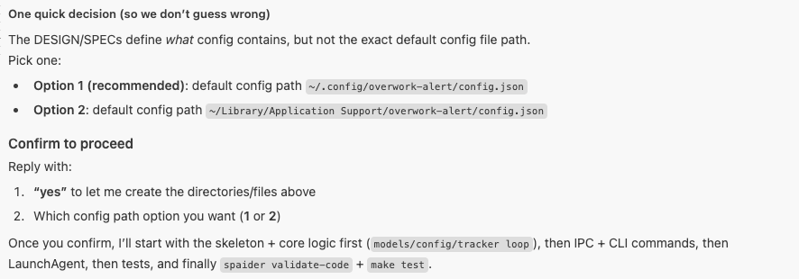

After: The agent asks for a single concrete decision (default config path option) and an explicit “yes” before creating the code directories/files.

Links:

- Config module (defaults + validation): [config.py](../examples/overwork_alert/src/overwork_alert/config.py)

### Create code skeleton + core modules (1800–1803)

#### 1800 — User confirms “yes, option 1” and the skeleton is created

Before: The user confirms file creation and chooses the default config path option.

After: The agent creates the package skeleton (`__init__`, `__main__`, core models/config/idle) as a safe foundation before wiring IPC/CLI/autostart.

Links:

- Package: [overwork_alert/](../examples/overwork_alert/src/overwork_alert/)
- Entrypoint: [__main__.py](../examples/overwork_alert/src/overwork_alert/__main__.py)
- Models: [models.py](../examples/overwork_alert/src/overwork_alert/models.py)
- Config: [config.py](../examples/overwork_alert/src/overwork_alert/config.py)
- Idle sampling: [idle.py](../examples/overwork_alert/src/overwork_alert/idle.py)

#### 1801 — Implement remaining modules: IPC + notify + policy + daemon + CLI + LaunchAgent

Before: The core modules exist, but the tool still needs the end-to-end wiring.

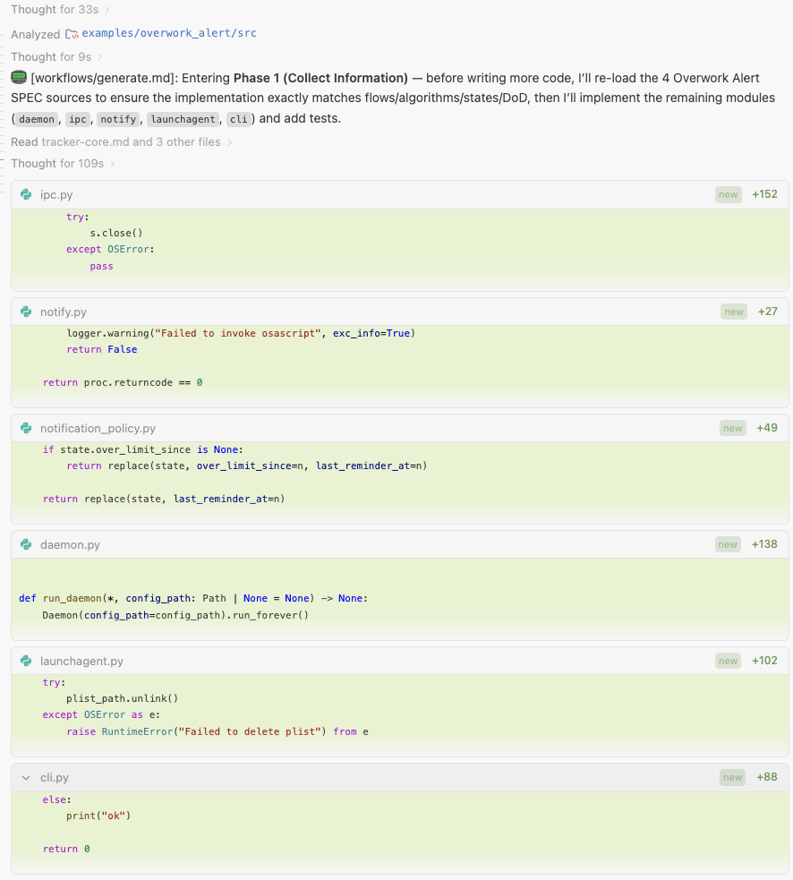

After: The agent implements the remaining modules so the CLI can control the daemon over a local UNIX socket, produce macOS notifications (best-effort), and support autostart via LaunchAgent.

Links:

- IPC: [ipc.py](../examples/overwork_alert/src/overwork_alert/ipc.py)
- Notify (osascript): [notify.py](../examples/overwork_alert/src/overwork_alert/notify.py)
- Notification policy: [notification_policy.py](../examples/overwork_alert/src/overwork_alert/notification_policy.py)
- Daemon loop: [daemon.py](../examples/overwork_alert/src/overwork_alert/daemon.py)
- CLI: [cli.py](../examples/overwork_alert/src/overwork_alert/cli.py)
- LaunchAgent install/uninstall: [launchagent.py](../examples/overwork_alert/src/overwork_alert/launchagent.py)

#### 1802 — Tighten STRICT traceability markers + semantic alignment fixes

Before: The code exists, but Spaider STRICT expects `@spaider-*` markers to cover each `to_code==true` SPEC ID, and conventions require docstrings.

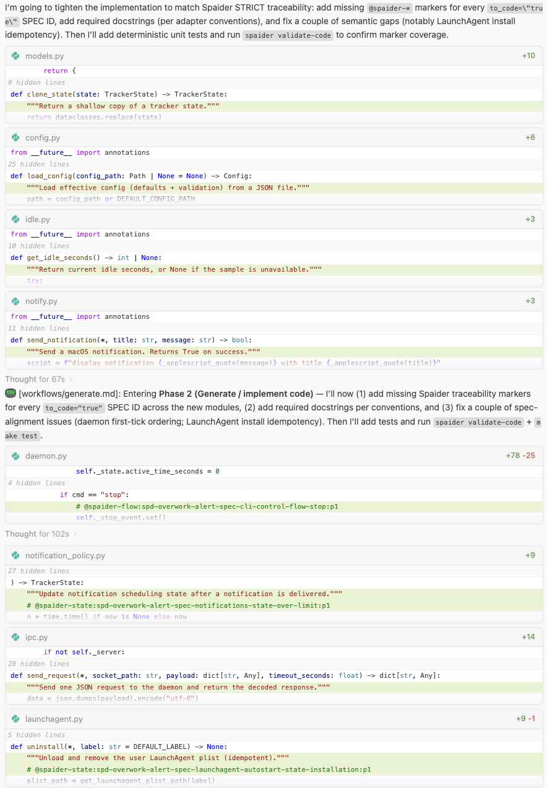

After: The agent adds missing traceability markers + docstrings and applies a couple of small semantic fixes to better match the SPEC behavior.

Links:

- Daemon: [daemon.py](../examples/overwork_alert/src/overwork_alert/daemon.py)
- Policy: [notification_policy.py](../examples/overwork_alert/src/overwork_alert/notification_policy.py)
- IPC: [ipc.py](../examples/overwork_alert/src/overwork_alert/ipc.py)
- LaunchAgent: [launchagent.py](../examples/overwork_alert/src/overwork_alert/launchagent.py)
- CLI: [cli.py](../examples/overwork_alert/src/overwork_alert/cli.py)

#### 1803 — Traceability pass + first test batch

Before: The user needs confidence that the SPEC→code mapping is real and the behavior is testable.

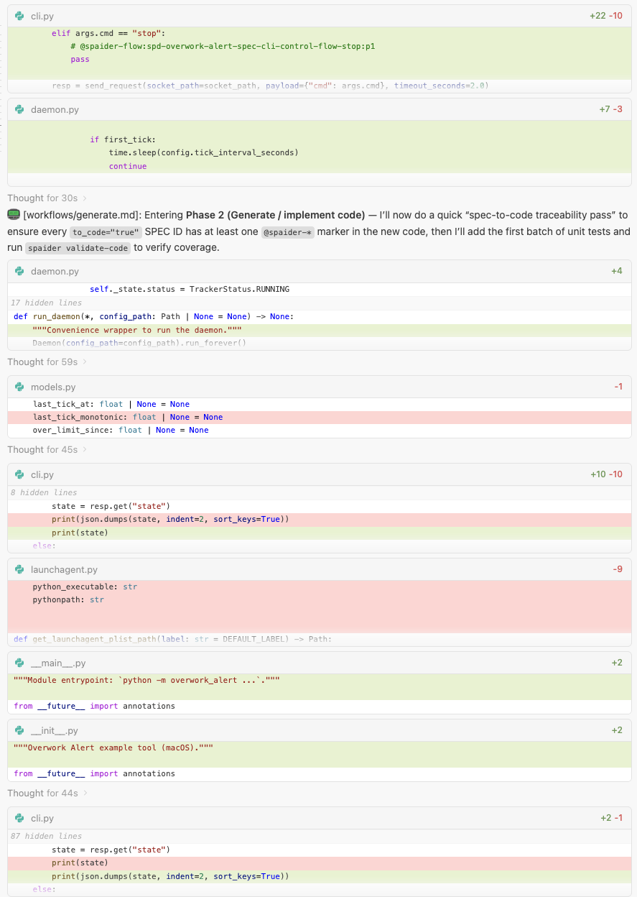

After: The agent performs a spec-to-code traceability pass, then prepares the initial unit test suite.

Links:

- Tests: [tests/](../tests/)

### Deterministic validation + tests (1804–1805)

#### 1804 — Make tests import the example package + add deterministic unit tests

Before: The test runner must be able to import the example code under `examples/overwork_alert/src/`.

After: The agent updates `tests/conftest.py` to put the example `src/` on `sys.path` and adds deterministic unit tests for tracker-core, notifications policy, IPC, and LaunchAgent plist generation.

Links:

- Pytest path setup: [tests/conftest.py](../tests/conftest.py)
- Tracker-core tests: [test_overwork_alert_tracker_core.py](../tests/test_overwork_alert_tracker_core.py)
- Notifications tests: [test_overwork_alert_notifications.py](../tests/test_overwork_alert_notifications.py)
- IPC tests: [test_overwork_alert_ipc.py](../tests/test_overwork_alert_ipc.py)
- LaunchAgent tests: [test_overwork_alert_launchagent.py](../tests/test_overwork_alert_launchagent.py)

#### 1805 — Fix validate-code warnings and confirm PASS

Before: `validate-code` reports traceability warnings that need a minimal, targeted cleanup.

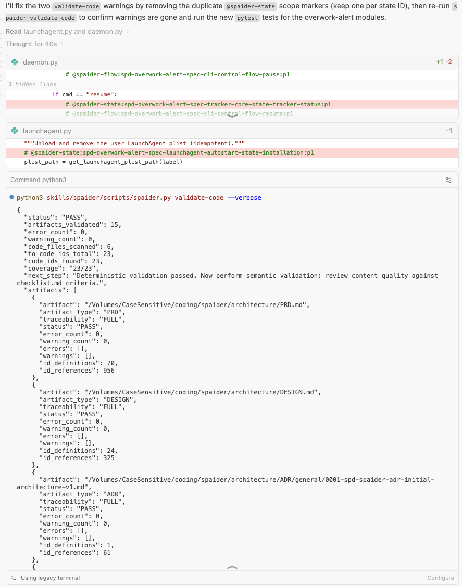

After: The agent removes duplicate scope markers, reruns `validate-code`, and confirms deterministic validation passes.

Links:

- Daemon: [daemon.py](../examples/overwork_alert/src/overwork_alert/daemon.py)
- LaunchAgent: [launchagent.py](../examples/overwork_alert/src/overwork_alert/launchagent.py)

### Install pytest + run tests + semantic validate (1806–1807)

#### 1806 — Compile sanity check + install pytest to run the new tests

Before: The implementation is complete and `validate-code` passes, but the new unit tests require pytest to be installed in the user environment.

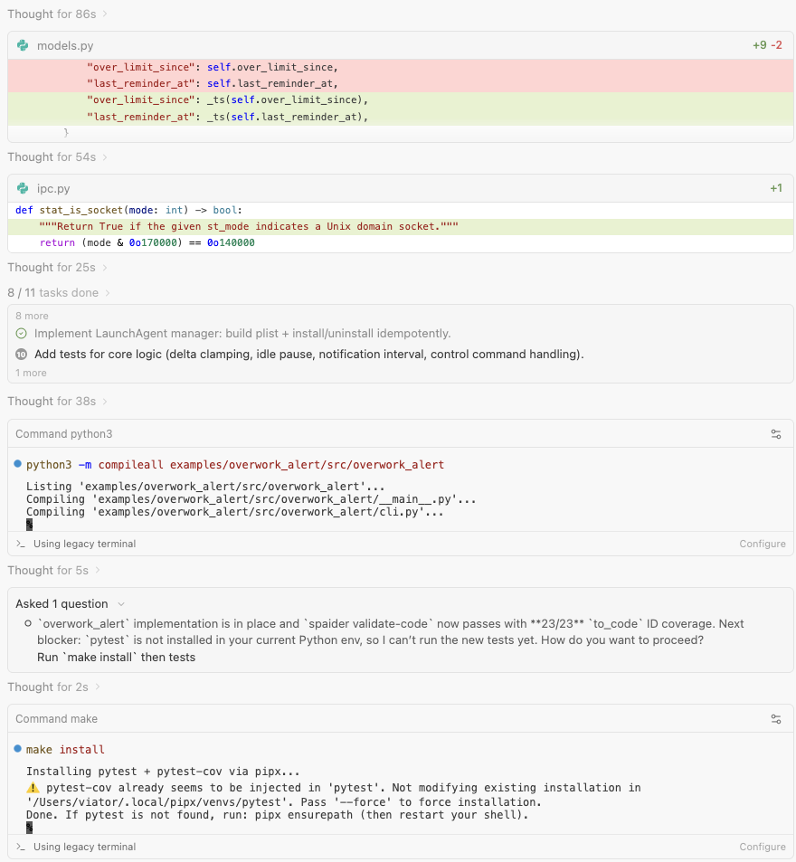

After: The agent makes a couple of small final code hygiene adjustments (e.g. timestamp serialization / socket helpers), runs a quick compile check, and then installs pytest via the repo’s `make install` target so the test suite can run.

Links:

- Models: [models.py](../examples/overwork_alert/src/overwork_alert/models.py)
- IPC: [ipc.py](../examples/overwork_alert/src/overwork_alert/ipc.py)

#### 1807 — Run the full test suite + semantic validation PASS

Before: With pytest installed, the user needs confidence that the new example tests are deterministic and do not break the wider repository test suite.

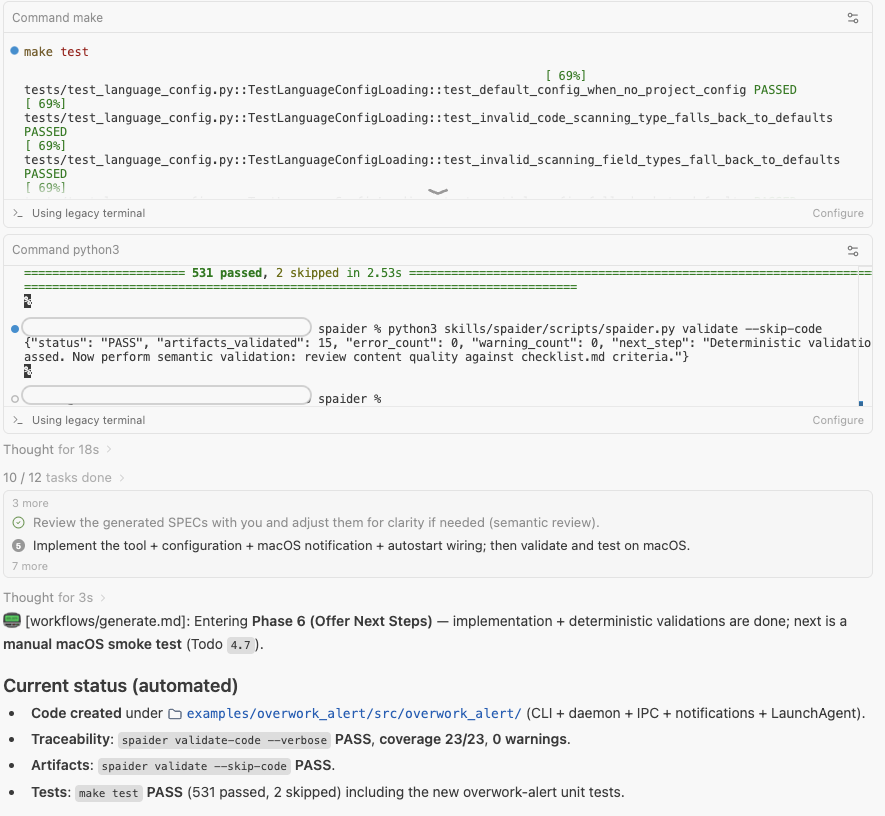

After: The agent runs `make test` and confirms a clean PASS, then runs a semantic validation pass (content-quality) to confirm the story/code/specs remain consistent.

Links:

- Tests: [tests/](../tests/)

### Manual macOS smoke test instructions (1808–1809)

#### 1808 — Provide a step-by-step macOS smoke test checklist

Before: Unit tests are passing, but the tool has OS-level behavior (notifications, LaunchAgent) that should be verified in a real macOS session.

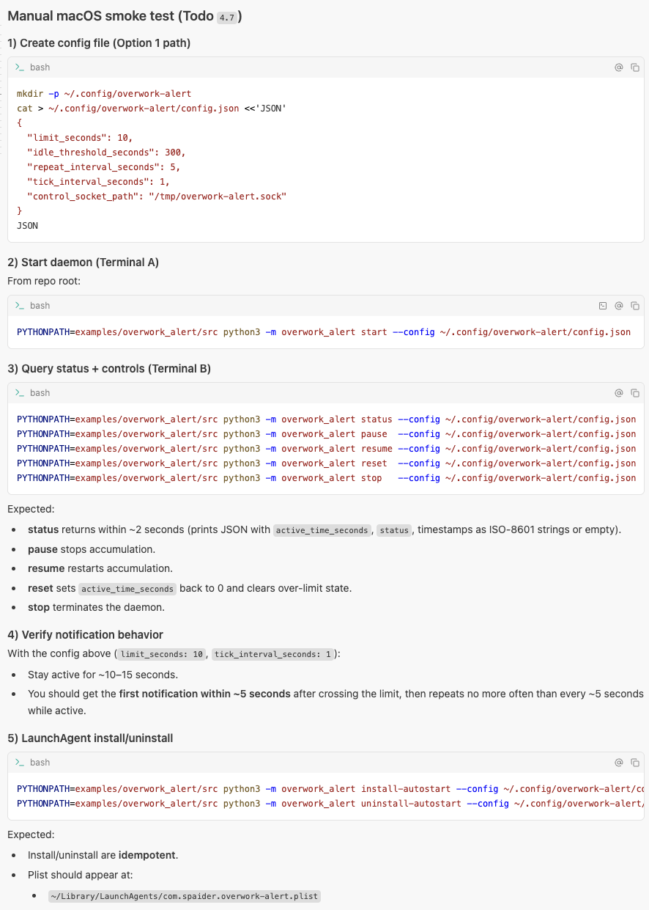

After: The agent provides an explicit, minimal smoke-test script: create config, start the daemon, run `status/pause/resume/reset/stop`, verify notification cadence, then install/uninstall the LaunchAgent and confirm plist behavior.

Links:

- Config: [config.py](../examples/overwork_alert/src/overwork_alert/config.py)
- CLI: [cli.py](../examples/overwork_alert/src/overwork_alert/cli.py)
- Daemon: [daemon.py](../examples/overwork_alert/src/overwork_alert/daemon.py)
- Notify: [notify.py](../examples/overwork_alert/src/overwork_alert/notify.py)
- LaunchAgent: [launchagent.py](../examples/overwork_alert/src/overwork_alert/launchagent.py)

#### 1809 — Ask for runtime feedback from the user

Before: After providing the checklist, the agent needs results from the real run to either close the loop or patch macOS-specific issues.

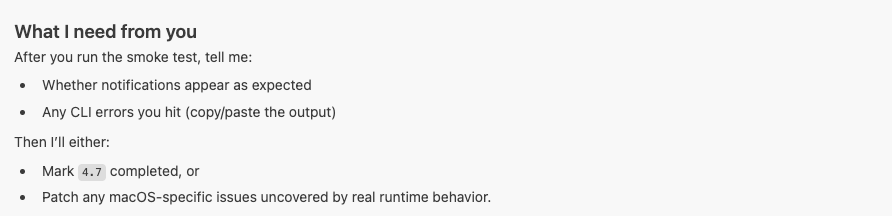

After: The agent asks for a short report: whether notifications appear correctly and any CLI errors, so it can either mark the smoke test done or apply targeted fixes.

### Smoke test results + final confirmation (1900–1901)

#### 1900 — User confirms everything works as expected on macOS

Before: The user completes the manual smoke test and reports success.

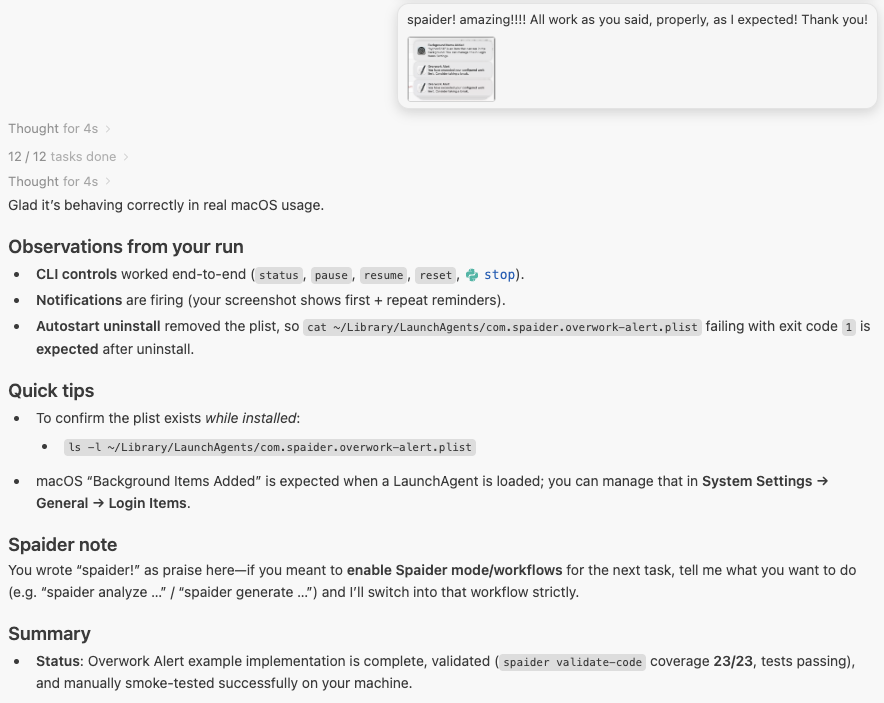

After: The agent summarizes observed outcomes (end-to-end CLI controls, notifications firing, LaunchAgent uninstall behavior) and provides a couple of practical tips about checking plist presence and macOS background-item prompts.

Links:

- CLI: [cli.py](../examples/overwork_alert/src/overwork_alert/cli.py)
- Notify: [notify.py](../examples/overwork_alert/src/overwork_alert/notify.py)
- LaunchAgent: [launchagent.py](../examples/overwork_alert/src/overwork_alert/launchagent.py)

#### 1901 — Evidence: macOS notifications + background items prompt

Before: The user shares the final proof that OS integrations behave correctly.

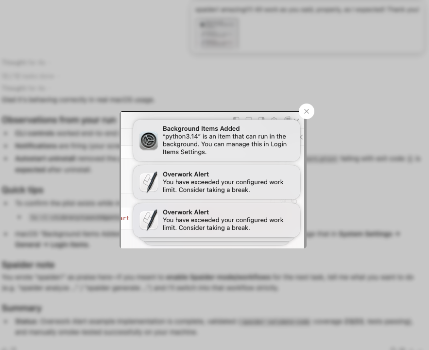

After: The screenshot confirms real macOS notifications for Overwork Alert and the expected “Background Items Added” system prompt after loading a LaunchAgent.
